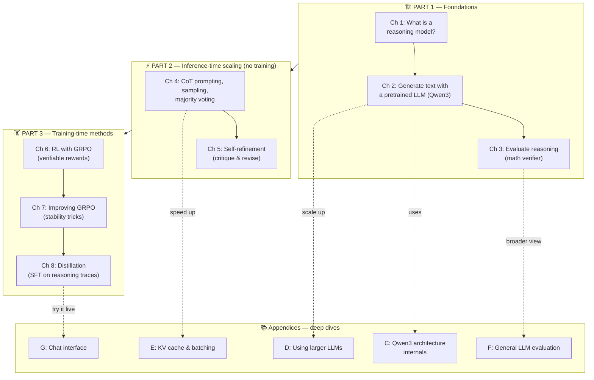
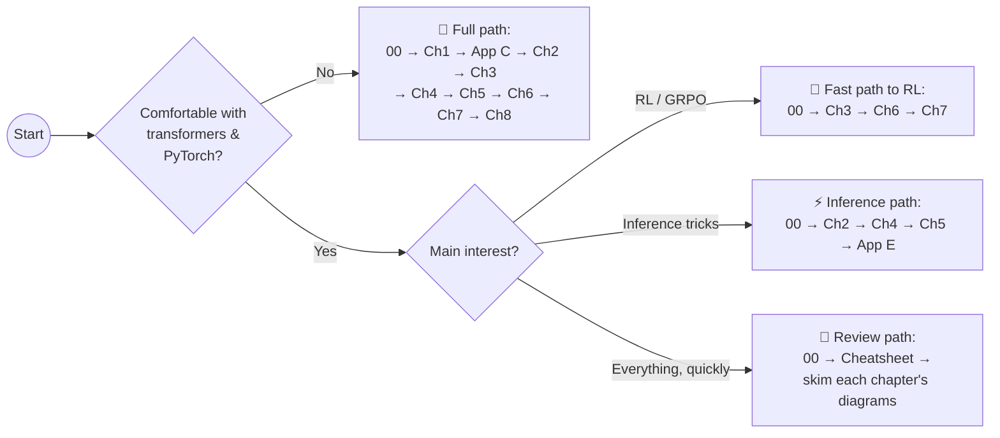

# 🧠 Build a Reasoning Model (From Scratch) — The Complete Study Guide

> A modular, diagram-first study companion for Sebastian Raschka's book
> **"Build a Reasoning Model (From Scratch)"** — taking you from *"what is a
> reasoning model?"* to implementing **GRPO reinforcement learning** and
> **distillation**, one small step at a time.

Every module follows the same philosophy:

1. **Simple first** — plain-English intuition before any math or code.
2. **Modular** — each chapter is self-contained; cross-links tell you when you need something from elsewhere.
3. **Flow diagrams for everything** — every algorithm, data flow, and training loop has a Mermaid diagram (rendered automatically by GitHub).
4. **Code you can hold in your head** — minimal PyTorch snippets with line-by-line commentary, not framework magic.

---

## 🗺️ The whole book on one map

**The core idea of the whole book in one sentence:**
*Take a small pretrained LLM, measure its reasoning ability with a verifiable
benchmark, then improve it — first without training (inference-time scaling),
then with training (reinforcement learning and distillation).*

---

## 📚 Study modules

### Part 1 — Foundations

| Module | What you'll master | Difficulty |
|---|---|---|
| [00 · The Big Picture](study_guide/00_big_picture.md) | The full pipeline, mental models, how everything connects | ⭐ |
| [Ch 1 · Understanding Reasoning Models](study_guide/ch01_understanding_reasoning_models.md) | What "reasoning" means for LLMs, the training pipeline, inference vs. train-time scaling | ⭐ |
| [Ch 2 · Generating Text with a Pretrained LLM](study_guide/ch02_generating_text.md) | Tokenization, the generation loop, greedy decoding, chat templates | ⭐⭐ |
| [Ch 3 · Evaluating Reasoning Models](study_guide/ch03_evaluating_reasoning.md) | Verifiable rewards, answer extraction, building a math verifier | ⭐⭐ |

### Part 2 — Inference-time scaling

| Module | What you'll master | Difficulty |
|---|---|---|
| [Ch 4 · Inference-Time Scaling](study_guide/ch04_inference_time_scaling.md) | Chain-of-thought prompting, temperature/top-k sampling, self-consistency (majority voting) | ⭐⭐ |
| [Ch 5 · Self-Refinement](study_guide/ch05_self_refinement.md) | Sequential scaling: the model critiques and improves its own answers | ⭐⭐ |

### Part 3 — Training-time methods

| Module | What you'll master | Difficulty |
|---|---|---|
| [Ch 6 · Training with Reinforcement Learning (GRPO)](study_guide/ch06_grpo_reinforcement_learning.md) | Policy gradients from zero, RLVR, group-relative advantages, the GRPO loss | ⭐⭐⭐⭐ |
| [Ch 7 · Improving GRPO](study_guide/ch07_improving_grpo.md) | Why vanilla GRPO breaks and the fixes: clip-higher, token-level loss, dynamic sampling, KL removal | ⭐⭐⭐⭐ |
| [Ch 8 · Distillation](study_guide/ch08_distillation.md) | Teacher→student transfer, SFT on reasoning traces, when distillation beats RL | ⭐⭐⭐ |

### Appendices — deep dives

| Module | What you'll master | Difficulty |
|---|---|---|
| [App C+D · Qwen3 Architecture from Scratch](study_guide/appendix_qwen3_architecture.md) | RMSNorm, RoPE, grouped-query attention, SwiGLU — every block of the transformer, plus scaling to larger models | ⭐⭐⭐⭐ |
| [App E · KV Cache & Batching](study_guide/appendix_kv_cache_batching.md) | Why generation is slow and the two big speedups | ⭐⭐⭐ |
| [App F · General LLM Evaluation](study_guide/appendix_evaluation_methods.md) | MMLU-style benchmarks, LLM-as-a-judge, leaderboards, perplexity | ⭐⭐ |
| [App G · Building a Chat Interface](study_guide/appendix_chat_interface.md) | Wrapping your model in an interactive chat UI with streaming | ⭐⭐ |

### Reference material

| Module | Purpose |
|---|---|
| [Glossary](study_guide/glossary.md) | Every term in the book, defined in one or two sentences |
| [Cheatsheet](study_guide/cheatsheet.md) | All formulas, hyperparameters, and diagrams on a few pages — ideal for review |

---

## 🧭 Recommended learning paths

---

## 🔑 The five ideas that carry the whole book

If you remember nothing else, remember these:

1. **Reasoning = intermediate steps.** A reasoning model doesn't just output an
   answer; it generates a chain of intermediate tokens ("thinking") that makes the
   final answer more likely to be right.
2. **Verifiable rewards change everything.** Math problems have checkable
   answers. That gives us a *free, automatic reward signal* — no human labeling,
   no learned reward model. This is the engine behind both evaluation (Ch 3) and
   RL training (Ch 6).
3. **You can buy accuracy with compute at inference time.** More sampled
   answers + majority voting, or generate→critique→revise loops, improve accuracy
   *without changing a single weight* (Ch 4–5).
4. **GRPO = policy gradient with a group baseline.** Sample several answers per
   question, score them, and push up the ones that scored above the group average.
   No value network needed (Ch 6–7).
5. **Distillation is the cheap alternative.** If a strong reasoning model
   already exists, supervised fine-tuning on its reasoning traces often gets you
   most of the benefit at a fraction of the cost (Ch 8).

---

## 📖 How to use this guide

- **Reading the book?** Read the book chapter first, then the matching module here to consolidate. The diagrams are designed to be the "index in your head."
- **No book at hand?** The modules are self-contained enough to learn the concepts and algorithms; the book adds the full runnable code and exercises.
- **Reviewing for an interview / exam?** Go straight to the [Cheatsheet](study_guide/cheatsheet.md) and each module's **Self-check** section.

Each module ends with:
- ✅ **Self-check questions** (with expandable answers)
- 🔗 **Where this connects** (previous/next module links)
- ⚠️ **Common pitfalls** collected in one place

Happy studying! 🚀
