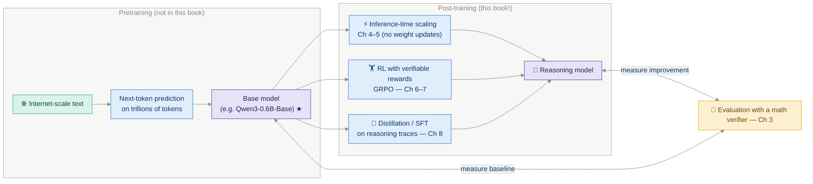
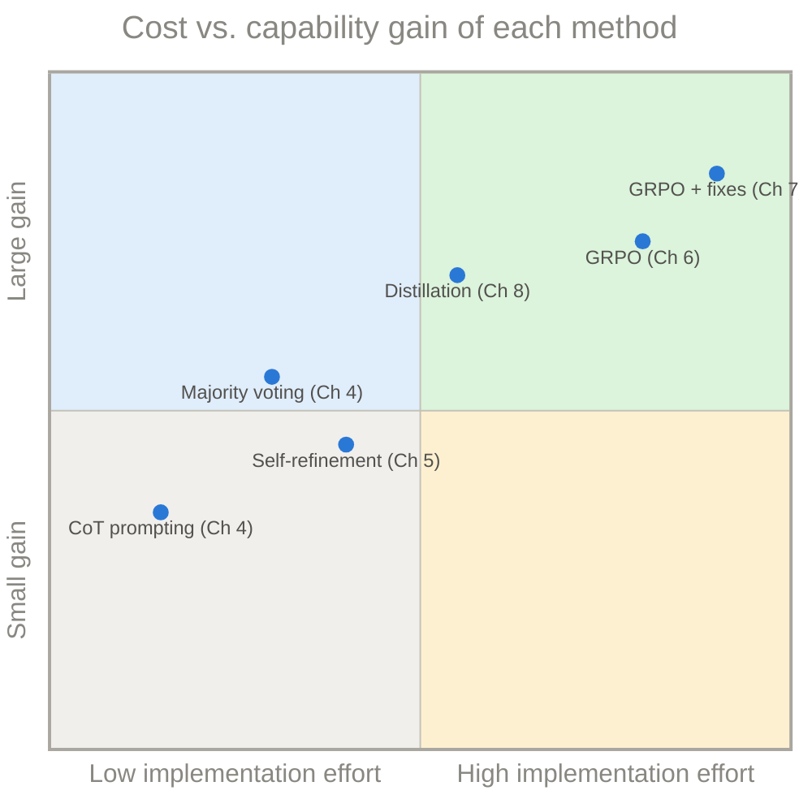
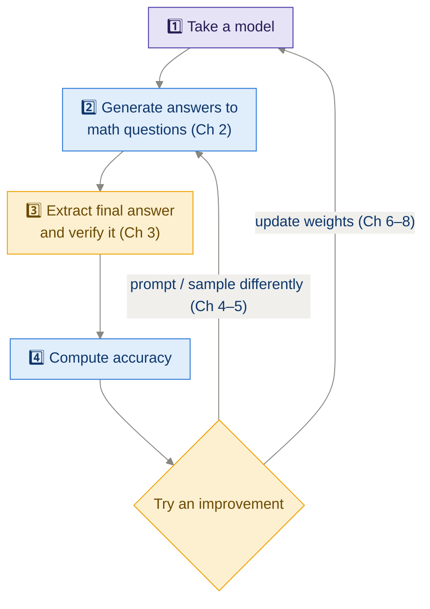

# 00 · The Big Picture — How a Reasoning Model Gets Built

> **Read this first.** Every other module zooms into one box of the diagrams on
> this page. If you ever feel lost later, come back here.

---

## 1. The one-paragraph version

A **reasoning model** is a large language model (LLM) that has been encouraged —
by prompting, by inference-time tricks, or by training — to produce
**intermediate steps** before its final answer. The book builds one from scratch
in three stages: **(1)** get a small pretrained LLM (Qwen3 0.6B) generating text
and **measure** how well it solves math problems whose answers can be checked
automatically; **(2)** improve accuracy **without training** by spending more
compute at inference time (sampling many answers, voting, self-refining);
**(3)** improve the model itself **with training**, using reinforcement learning
(GRPO) driven by those same automatic answer checks, and alternatively by
distilling a stronger teacher's reasoning traces into the student.

---

## 2. Where reasoning models come from (the full LLM pipeline)

Before this book starts, a lot has already happened. Here is the standard LLM
life cycle — the book picks up at the ★:

**Key insight:** the three improvement arrows are *independent and composable*.
You can apply inference-time scaling to an RL-trained model, distill a model and
then run RL on it, and so on. Real systems (DeepSeek-R1, OpenAI o-series) combine
several.

---

## 3. The three levers, compared

| | ⚡ Inference-time scaling (Ch 4–5) | 🏋️ RL / GRPO (Ch 6–7) | 📖 Distillation (Ch 8) |
|---|---|---|---|
| **Changes model weights?** | ❌ No | ✅ Yes | ✅ Yes |
| **Needs training data?** | ❌ No | Questions + checkable answers | Teacher's reasoning traces |
| **Cost paid at…** | Every inference (forever) | Training time (once) | Training time (once) |
| **Core mechanism** | Sample more / think longer / revise | Trial & error + reward for correct answers | Imitate a stronger model |
| **Ceiling** | Limited by what the base model *can* sample | Can discover *new* behaviors | Limited by the teacher |
| **Fragility** | Robust, simple | Hyperparameter-sensitive, can collapse | Robust, simple |

---

## 4. The experimental loop you'll repeat all book long

Everything in the book is one instance of this loop:

This is why **Chapter 3 (evaluation) is the keystone chapter**: without a
trustworthy, automatic verifier you can neither measure progress *nor* train
with reinforcement learning (the verifier literally *is* the reward function in
Ch 6).

---

## 5. The cast of characters

| Thing | Role in the book |
|---|---|
| **Qwen3-0.6B (base)** | The small pretrained LLM everything is built on — small enough to run on a laptop |
| **Qwen3-0.6B (reasoning/"thinking")** | The official post-trained variant, used for comparison |
| **MATH-500-style problems** | Math word problems with a single checkable numeric/symbolic answer |
| **The verifier** | Code that extracts the final answer (e.g. from `\boxed{...}`) and checks equality with the reference |
| **The generate function** | The token-by-token sampling loop from Ch 2 — reused *everywhere* |
| **GRPO** | The RL algorithm (Group Relative Policy Optimization) that turns verifier output into weight updates |

---

## 6. Mental models to carry with you

### 🎰 An LLM is a next-token slot machine
The model outputs a probability for every token in the vocabulary; *decoding
strategy* decides how to pick one. Greedy = always take the most likely.
Sampling = spin the wheel. Everything in Ch 4 is about pulling this lever
multiple times and aggregating.

### 🧗 Reasoning tokens are footholds
Each intermediate step conditions the next prediction. Writing "Let me compute
17 × 23 step by step" literally changes the probability distribution of every
subsequent token toward correct arithmetic. That's why *more tokens can mean
more accuracy* — the model is buying itself easier subproblems.

### 🏫 RL is a teacher who only grades the final exam
GRPO never says *which step* was wrong. It only rewards a whole answer that
ended correctly. The gradient math (Ch 6) spreads that single scalar across all
tokens of the answer. This weak-but-honest signal is enough — that's the
surprising empirical result behind DeepSeek-R1-Zero and this book's Part 3.

### 👨‍🏫 Distillation is a teacher who shows worked solutions
Instead of grading, the teacher writes out full reasoning traces and the student
imitates them token by token (plain cross-entropy). Simpler signal, faster
learning, but the student can't exceed the teacher.

---

## 7. Notation used across all modules

| Symbol | Meaning |
|---|---|
| `x` | prompt / question tokens |
| `y = (y₁ … y_T)` | generated response tokens |
| `π_θ(y_t \| x, y_<t)` | probability the model (policy) with weights θ assigns to token `y_t` given everything before it |
| `r` or `R` | reward (1 = correct answer, 0 = wrong, in the simplest setup) |
| `A` | advantage — how much better a response is than a baseline |
| `G` | group size in GRPO (number of sampled answers per question) |
| `ε` | PPO/GRPO clipping range |
| `β` | KL-penalty coefficient |

---

## ✅ Self-check

1. Why does the book implement evaluation (Ch 3) before any improvement method?

Because every improvement — prompting tricks, RL, distillation — is judged by
the same accuracy metric, and because the RL reward in Ch 6 *is* the verifier.
No verifier → no measurement → no training signal.

2. Name the key trade-off between inference-time scaling and RL training.

Inference-time scaling needs no training and is easy to implement, but you pay
extra compute on *every single query, forever*, and you can only surface
abilities the base model already has. RL costs a lot once (training) but the
improved weights make every future query cheaper/better, and it can create new
behaviors.

3. What does "verifiable reward" mean and why is math the ideal domain for it?

A reward that can be computed automatically by checking the model's final
answer against a known ground truth. Math (and code, via unit tests) is ideal
because equality of a final numeric/symbolic answer is cheap and objective to
check — no human judgment or learned reward model needed.

---

## 🔗 Where to go next

- New to transformers → [App C+D · Qwen3 Architecture](appendix_qwen3_architecture.md) first, then [Ch 1](ch01_understanding_reasoning_models.md).
- Otherwise → [Ch 1 · Understanding Reasoning Models](ch01_understanding_reasoning_models.md).
