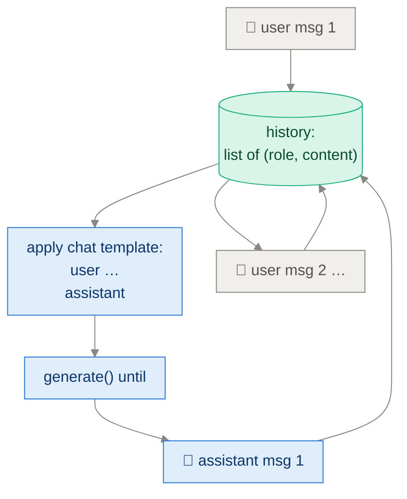
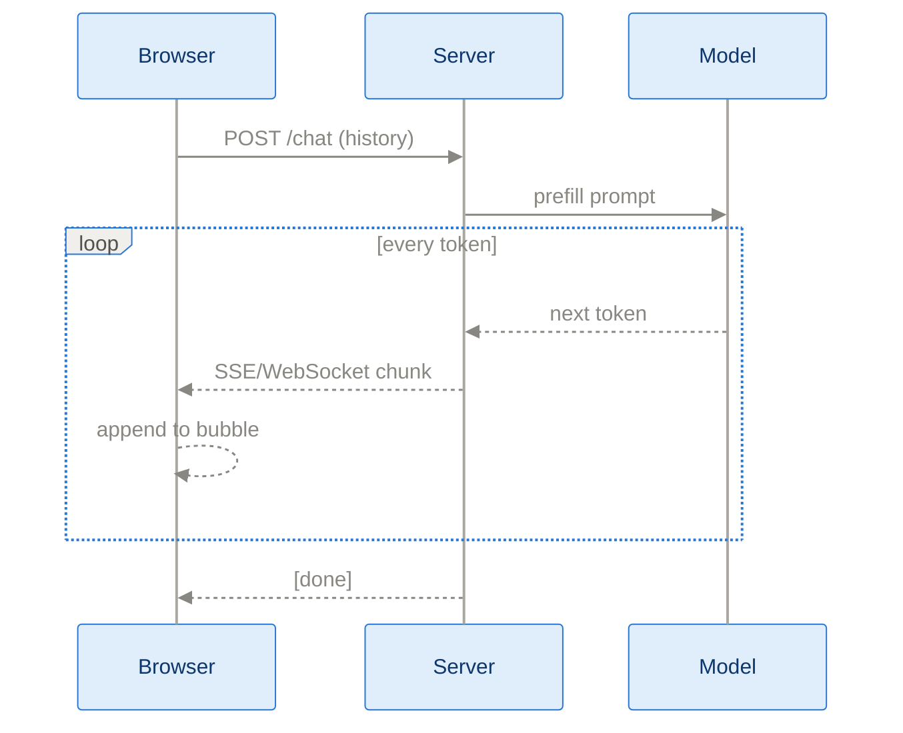
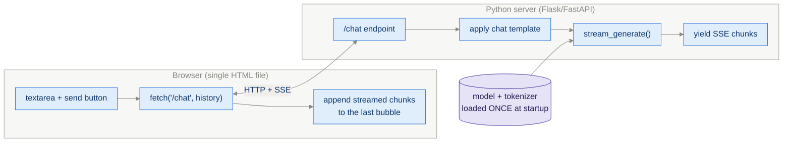

# App G · Building a Chat Interface

> **Goal of this module:** turn the `generate()` function into an interactive,
> streaming chat app — and understand the three pieces that requires:
> conversation state, incremental (streamed) decoding, and a thin UI layer.

**Prerequisites:** [Ch 2](ch02_generating_text.md). [App E](appendix_kv_cache_batching.md) makes it pleasant.

---

## 1. From one-shot generation to conversation

A chat is just repeated generation over a **growing transcript** formatted
with the chat template (Ch 2 §2):



```python
history = []
while True:
    history.append({"role": "user", "content": input("You: ")})
    prompt = apply_chat_template(history)          # ENTIRE history, every turn
    reply  = generate_text(model, tok, prompt, stop=IM_END)
    history.append({"role": "assistant", "content": reply})
```

Key mental shift: **the model is stateless.** All "memory" lives in the
transcript you resend each turn. Consequences:

- Context grows every turn → eventually exceeds the window → you must
  **truncate or summarize** old turns (keep the system message!).
- Re-prefilling the whole history each turn is wasted work → a persistent
  **KV cache across turns** (App E) fixes it: only the new tokens get prefilled.

---

## 2. Streaming — perceived speed is real speed

Generation takes seconds; users hate silent seconds. Since tokens are produced
one-by-one anyway (Ch 2 loop), just **emit each token as it's decoded**:

```python
def stream_generate(model, tok, ids, ...):
    for _ in range(max_new_tokens):
        nxt = pick_next_token(model, ids)          # Ch 2/Ch 4 logic
        if nxt == eos: break
        ids = torch.cat([ids, nxt], dim=1)
        yield tok.decode_incremental(nxt)          # ← the only new line: yield!
```



Transport options, simplest first: terminal `print(chunk, end="", flush=True)`
→ **Server-Sent Events** (one-way, perfect fit, trivial) → WebSockets (only if
you need two-way, e.g. a stop button).

> ⚠️ **Streaming decode gotcha:** BPE tokens are byte fragments; decoding
> token-by-token can split multi-byte UTF-8 characters (�). Use the
> tokenizer's incremental-decoding support, or buffer until output is valid
> UTF-8.

### Chat-specific niceties for a *reasoning* model

- Render `<think>…</think>` content collapsed/dimmed — users want the answer,
  with thinking inspectable on demand. (You built that distinction in Ch 2/8.)
- A **stop** control matters more than usual: thinking can run long.
- Show token counts — after this book you know exactly what they cost.

---

## 3. The minimal web app



```python
# FastAPI sketch — the whole backend is ~30 lines
app = FastAPI()
model, tok = load_model_once()               # NOT per-request!

@app.post("/chat")
def chat(history: list[Message]):
    prompt = apply_chat_template(history)
    return StreamingResponse(
        (chunk for chunk in stream_generate(model, tok, encode(prompt))),
        media_type="text/event-stream",
    )
```

Engineering notes that separate "demo" from "works":

| Concern | Rule |
|---|---|
| Model loading | Once, at startup. Reloading per request = 10s latency. |
| Concurrency | One GPU generation at a time (lock or queue); or batch concurrent requests (App E). |
| Sampling params | Expose temperature/top-k in the UI — instant Ch 4 intuition builder. |
| History limit | Cap turns or tokens; never let the template exceed the context window. |
| `model.eval()` + `no_grad` | Same Ch 2 rules; a server amplifies every per-request waste. |

---

## 4. Why this appendix earns its place in a *reasoning* book

It closes the loop on everything:

- Chat template correctness (Ch 2) stops being abstract the moment your bot
  starts talking to itself.
- Watching a distilled model (Ch 8) stream a short `<think>` block where the
  base model rambled is the most visceral before/after in the book.
- Latency pain in chat *is* the motivation for KV caching (App E) and for
  efficient reasoning (Ch 8 §4).

---

## ⚠️ Common pitfalls

- **Rebuilding the prompt wrong on turn 2+** (missing `<|im_end|>`, doubled system message) → model quality mysteriously degrades *only in conversation*. Diff your rendered template against turn 1.
- **Forgetting to strip/handle `<think>` blocks in history** — refeeding long thinking traces each turn burns context; most chat templates drop previous-turn thinking.
- **Decoding partial UTF-8** → � characters (see gotcha above).
- **Per-request model loading** or per-request CUDA context → seconds of latency.
- **No request lock** → two simultaneous users interleave CUDA ops → crashes or garbage.
- **Unbounded history** → context overflow → silent truncation of the *system prompt* (the worst possible token to lose).

---

## ✅ Self-check

<details><summary>1. The model is stateless — so where does conversation memory live, and what two costs does that create?</summary>

In the transcript resent every turn. Costs: (1) context grows until it
overflows the window (need truncation/summarization), (2) re-prefilling old
turns wastes compute (fixed by persisting the KV cache across turns).
</details>

<details><summary>2. Why is SSE usually the right transport for chat streaming rather than WebSockets?</summary>

Token streaming is strictly one-directional (server → client) and SSE does
exactly that over plain HTTP with automatic reconnection and trivial server
code; WebSockets add bidirectional complexity you only need for things like
mid-generation cancel signals.
</details>

<details><summary>3. Your streamed output shows � occasionally, but the final text is fine after refresh. Explain.</summary>

A multi-byte UTF-8 character was split across two BPE tokens; decoding each
token independently produced an invalid partial byte sequence. Buffer bytes
until they form valid UTF-8 (or use the tokenizer's incremental decoder).
</details>

<details><summary>4. What should a chat UI do with <code>&lt;think&gt;</code> content and why?</summary>

Render it collapsed/secondary (and usually exclude it from the history sent
on later turns): users want answers first, the trace on demand — and
re-sending thousands of thinking tokens each turn wastes context and money.
</details>

---

## 🔗 Where this connects

- **The generation engine:** [Ch 2](ch02_generating_text.md) · **speed:** [App E](appendix_kv_cache_batching.md).
- **The model you'll want to serve:** [Ch 8 · Distillation](ch08_distillation.md).
- **Index:** [README](../README.md)
