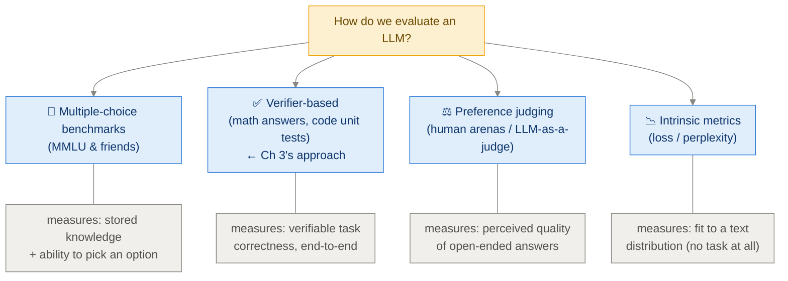
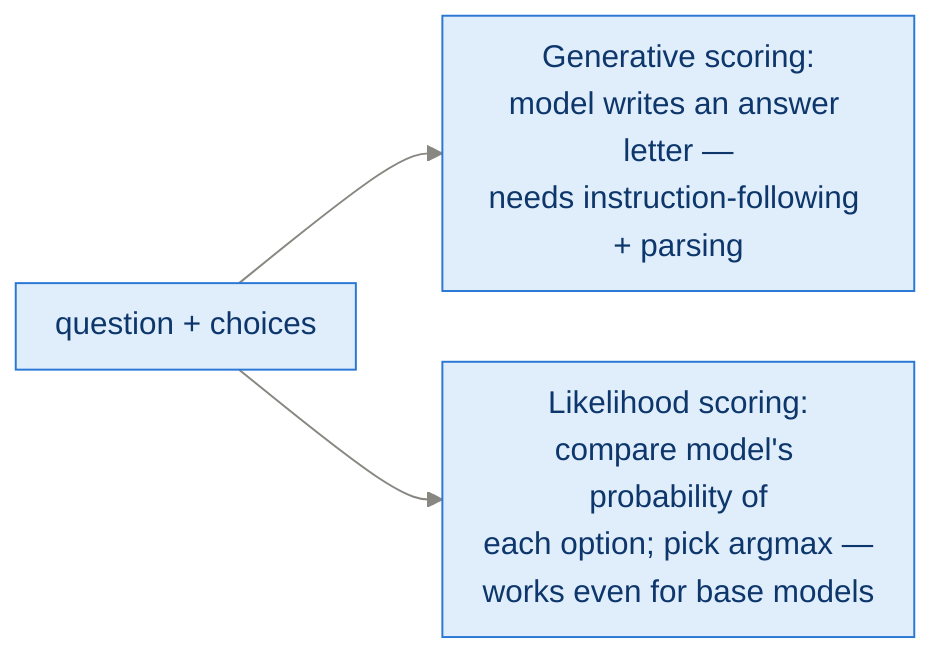
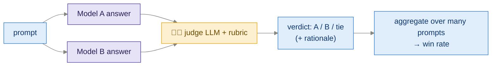
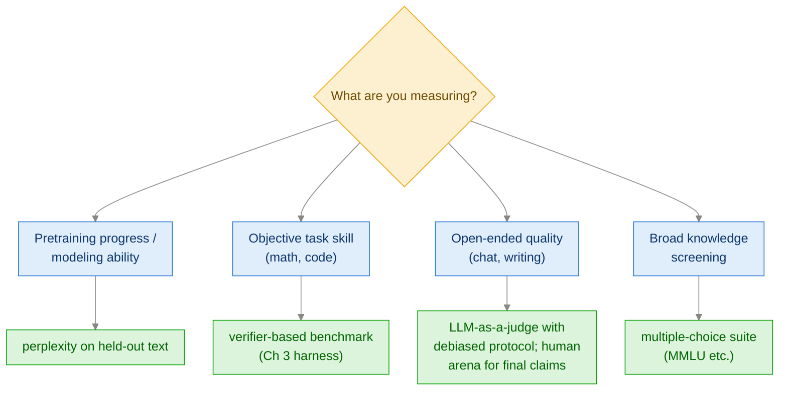

# App F · Common Approaches to Model Evaluation

> **Goal of this module:** zoom out from the math-verifier world of Ch 3 and
> map the *four* major ways LLMs are evaluated in general — what each measures,
> what each misses, and when to use which.

**Prerequisites:** [Ch 3](ch03_evaluating_reasoning.md) (one of the four, in depth).

---

## 1. The four families



One line each:

| Family | Question it answers | Automatable? | Gameable? |
|---|---|---|---|
| Multiple-choice | "Does it know facts and can it select the right option?" | ✅ fully | contamination, option-guessing |
| Verifier-based | "Can it actually solve the task?" | ✅ fully | reward hacking if used for training |
| Preference judging | "Do humans/judges *prefer* its answers?" | partially (LLM judge) | style over substance |
| Perplexity | "How well does it model text?" | ✅ fully | says little about downstream skills |

---

## 2. Multiple-choice benchmarks (MMLU-style)

Format: question + options A–D; score = fraction correct.

Two scoring styles, and the difference matters:



- **Likelihood scoring** probes pure knowledge — no formatting skill needed;
  standard for evaluating *base* models.
- **Generative scoring** mixes in instruction-following ability, closer to
  real usage.

Strengths: cheap, standardized, comparable across papers. Weaknesses:
**contamination** (test questions leak into pretraining data), saturation at
the frontier, and no measurement of *generation* quality — a model can ace
MMLU and still write terrible proofs. For a *reasoning* book, multiple-choice
is a blunt tool: guessing yields 25%, and choosing among given options is a
much easier task than producing an answer from nothing (which is why Ch 3
built a free-form verifier instead).

---

## 3. Verifier-based evaluation (Ch 3's family)

Covered in depth in [Ch 3](ch03_evaluating_reasoning.md). The general pattern
extends beyond math:

| Domain | Verifier |
|---|---|
| Math | answer equivalence check |
| Code | **unit tests** (run the generated code) |
| Games/puzzles | rules engine / solver |
| Tool use | did the API call produce the right state? |

The gold standard *where it applies* — objective, scalable, and doubles as an
RL reward (RLVR, Ch 6). Its limitation is coverage: most valuable tasks
(writing, advice, summarization) have no verifier. Hence family 3:

---

## 4. Preference-based judging

### 4.1 Human arenas (LMArena-style)

Two anonymous models answer the same prompt; humans vote; votes aggregate into
**Elo-style ratings**. Captures "real" perceived quality across everything at
once — and inherits human biases: verbosity, confident tone, and formatting
win votes independent of correctness.

### 4.2 LLM-as-a-judge

Replace the human voter with a strong LLM and a grading rubric:



Scales infinitely and correlates well with human preference — but budget for
its known biases, and **mitigate each one deliberately**:

| Judge bias | Mitigation |
|---|---|
| Position bias (favors first answer) | judge each pair twice, swapped |
| Length bias (favors longer) | length-controlled win rates |
| Self-preference (favors own family's style) | use a judge from a different model family |
| Style over substance | rubric anchored on correctness; supply a reference answer |

> Connection to the book's theme: LLM-as-a-judge is a *learned, soft* verifier
> — exactly the kind of reward that demands the KL guardrails Ch 7 dropped for
> hard verifiers. The harder and more objective your grader, the fewer
> defenses you need.

---

## 5. Loss / perplexity — the intrinsic metric

**Perplexity** = exp(average next-token cross-entropy) on held-out text —
"how surprised is the model, per token?" Lower is better; a perplexity of k
means the model is as uncertain, on average, as choosing among k equally
likely tokens.

```python
ppl = torch.exp(F.cross_entropy(logits[:, :-1].transpose(1, 2), ids[:, 1:]))
```

Where it shines: tracking **pretraining** progress, comparing checkpoints of
the *same* model on the *same* data — smooth, cheap, sensitive.
Where it fails: comparing across tokenizers (different token counts → not
comparable!), and predicting task skills — RL-trained reasoning gains (Ch 6)
barely move perplexity, and an RL model's perplexity on generic text may even
*worsen* while math accuracy soars.

---

## 6. Choosing an evaluation — decision guide



Universal hygiene, whatever you pick:

1. **Hold out.** Never evaluate on training questions (Ch 8 pitfall).
2. **Fix the harness.** Prompts, decoding params, extraction rules frozen; only then are two numbers comparable (Ch 3 pitfall).
3. **Mind contamination.** Public benchmark + web-pretrained model = assume leakage until checked.
4. **Report uncertainty.** Small eval sets swing several points (Ch 3 §5).
5. **Use a portfolio.** One metric = one exploitable proxy. The book itself pairs the math verifier (skill) with qualitative response inspection (sanity).

---

## ⚠️ Common pitfalls

- **Comparing perplexities across models with different tokenizers/vocabs** — meaningless without per-byte normalization.
- **Trusting judge verdicts without swap-testing** for position bias.
- **Reading arena Elo as "correctness"** — it's *preference*, verbosity included.
- **Benchmark saturation blindness** — near-ceiling scores can't differentiate models; move to a harder set.
- **Single-benchmark victory laps** — improvements that don't replicate on a second benchmark are usually harness artifacts.

---

## ✅ Self-check

<details><summary>1. Why did the book pick verifier-based evaluation over MMLU for reasoning?</summary>

Reasoning is about *producing* multi-step solutions, not selecting among four
given options (25% by guessing). Free-form answers with automatic verification
measure the actual skill — and the same verifier later powers RL training and
distillation filtering.
</details>

<details><summary>2. Name the three classic LLM-judge biases and one mitigation each.</summary>

Position bias → judge both orderings; length/verbosity bias → length-
controlled win rates; self-preference bias → use a judge from a different
model family (plus: anchor the rubric with a reference answer).
</details>

<details><summary>3. Your RL-trained model (Ch 6) improved math accuracy by 15 points but perplexity on Wikipedia got worse. Contradiction?</summary>

No. Perplexity measures fit to generic text; RL shifted the distribution
toward long math reasoning (and KL-free training allows drift, Ch 7 Fix 5).
Task skill up + generic-text fit down is the expected signature — it's why we
evaluate with a portfolio, and a reason one might keep some KL anchor.
</details>

<details><summary>4. When is perplexity the RIGHT tool?</summary>

Tracking pretraining/fine-tuning progress of the same architecture and
tokenizer on a fixed held-out set — it's smooth, cheap, and sensitive where
task benchmarks are noisy step functions.
</details>

---

## 🔗 Where this connects

- **The verifier family in depth:** [Ch 3 · Evaluating Reasoning](ch03_evaluating_reasoning.md).
- **Soft rewards need guardrails:** [Ch 7 · Improving GRPO](ch07_improving_grpo.md) §6.
- **Index:** [README](../README.md)
