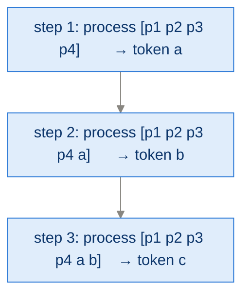
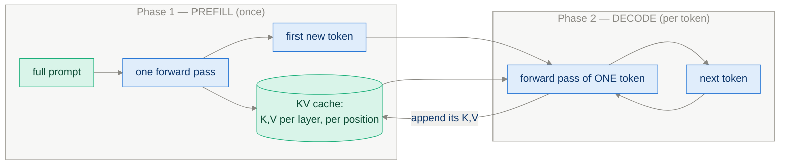
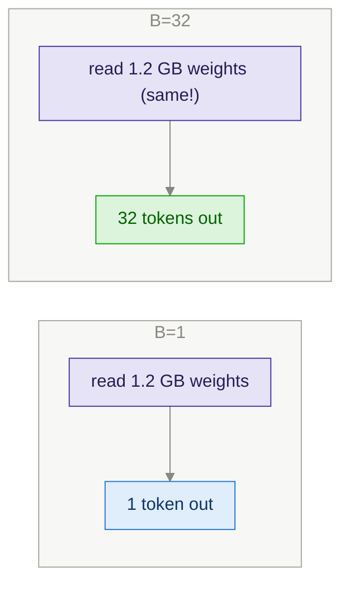
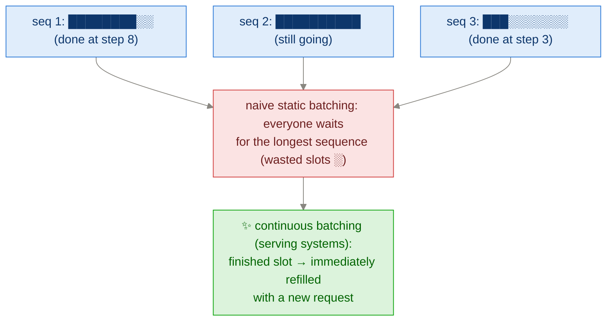

# App E · Batching and Throughput-Oriented Execution (KV Cache & Friends)

> **Goal of this module:** understand why the naive Ch 2 loop is slow, and the
> two structural fixes — the **KV cache** (don't recompute the past) and
> **batching** (amortize every weight-read across many sequences). These turn
> Ch 4's "sample 16 answers" and Ch 6's rollouts from painful to practical.

**Prerequisites:** [Ch 2](ch02_generating_text.md), and [App C](appendix_qwen3_architecture.md) §4 (attention) helps.

---

## 1. Why naive generation is quadratically wasteful

The Ch 2 loop feeds the **whole sequence** through the model for **every new
token**:



Everything about `p1…p4` was already computed in step 1 and gets recomputed in
steps 2, 3, 4… Generating T tokens over a prompt of length P costs
O((P+T)·T) token-computations instead of O(P+T).

**Key observation:** in causal attention, the K and V vectors of past tokens
**never change** (position t attends only backwards; adding a token at the end
alters nothing behind it). So cache them.

---

## 2. The KV cache

Store each layer's K and V for all processed tokens. Each new step feeds **only
the one new token**; its Q attends against the cached K/V:



```python
# inside attention, per layer:
k_new, v_new = project(x_new)                    # x_new: just 1 token
K = torch.cat([cache.K, k_new], dim=seq_dim)     # append
V = torch.cat([cache.V, v_new], dim=seq_dim)
cache.K, cache.V = K, V
out = attention(q_new, K, V)                     # 1 query vs. all past keys
```

Two phases with *very different characters*:

| | Prefill | Decode |
|---|---|---|
| Processes | whole prompt in parallel | one token at a time |
| Bound by | **compute** (big matmuls) | **memory bandwidth** (read all weights + cache per token) |
| Felt by user as | time-to-first-token | tokens/second |

### The price: memory

The cache is why GQA exists (App C §4.2):

```
cache bytes ≈ 2 (K and V) × layers × kv_heads × head_dim × seq_len × bytes_per_elt
Qwen3-0.6B, bf16, 8k context: 2 × 28 × 8 × 128 × 8192 × 2 ≈ 0.9 GB  — per sequence!
```

Long-CoT reasoning (thousands of thinking tokens, Ch 4–7) makes this *the*
binding constraint. Halving KV heads (GQA) halves it; quantized caches and
sliding windows go further.

> **Correctness caveat:** with RoPE, cached K's are rotated by *absolute*
> position — so track positions explicitly; the new token's Q/K must be rotated
> by its true index, not by 0.

---

## 3. Batching — the other axis

Decode is memory-bandwidth-bound: generating one token requires streaming *all
weights* (~1.2 GB for 0.6B in bf16) through the GPU to do a tiny matvec. The
GPU's compute units idle.

**Fix:** process B sequences at once. Weights are read **once** per step and
reused for B tokens — throughput scales almost linearly until compute
saturates.



This is *exactly* what Ch 4's self-consistency and Ch 6's GRPO rollouts need:
N samples of the **same prompt** = a batch (prefill once, share it, decode N
continuations).

### The ragged-batch problem

Sequences in a batch differ in length → padding + an **attention mask** so pad
tokens are ignored; and sequences *finish* at different times:



The book implements clean static batching; production engines (vLLM etc.) add
continuous batching + **PagedAttention** (KV cache in non-contiguous pages,
eliminating fragmentation — "virtual memory for the cache"). Know the names;
the principles are the two above.

### Latency vs. throughput

Bigger batches = more tokens/sec *total* but each individual sequence can get
slower. Chat UIs (App G) want low latency (small B); evaluation harnesses
(Ch 3) and RL rollouts (Ch 6) want max throughput (big B). Same code, different
knob settings.

---

## 4. What this buys each chapter

| Consumer | Without this appendix | With cache + batching |
|---|---|---|
| Ch 3 eval (500 problems) | hours | minutes |
| Ch 4 maj@16 | 16× sequential generations | one batched run |
| Ch 6 GRPO rollouts (B questions × G samples) | dominant cost, impractical | tractable; rollouts still dominate but by a small factor |
| App G chat | sluggish first token | snappy prefill + streamed decode |

---

## ⚠️ Common pitfalls

- **Recomputing rotary positions from 0 for the new token** (see RoPE caveat) → subtle degradation after a few hundred tokens.
- **Forgetting to reset the cache between prompts** → the model "remembers" the previous conversation and answers nonsense.
- **Letting the cache grow unbounded** in a chat loop → OOM after a long session; trim or cap.
- **Comparing greedy outputs with/without cache and finding tiny diffs** → floating-point nondeterminism (different matmul shapes); bitwise equality is not the test, distribution equality is.
- **Padding without masking** → pad tokens leak into attention; batched results silently differ from single-sequence results. Always verify batched vs. unbatched output parity on a couple of prompts.

---

## ✅ Self-check

<details><summary>1. Why are past K/V cacheable but past logits not worth caching?</summary>

K/V of past positions never change under causal attention, and they're needed
by *every future step* — perfect reuse. Past positions' logits are needed only
once (we already picked those tokens) — nothing future reads them.
</details>

<details><summary>2. Why does batching improve decode throughput so dramatically?</summary>

Decode is memory-bandwidth-bound: each step must stream all model weights
regardless of batch size. With B sequences, that one stream of weights
produces B tokens instead of 1 — the bandwidth cost is amortized.
</details>

<details><summary>3. Compute the KV cache size for Qwen3-0.6B at 32k context, bf16. Why did the architects choose 8 KV heads?</summary>

2 × 28 layers × 8 heads × 128 dim × 32768 × 2 bytes ≈ 3.7 GB per sequence.
With 16 KV heads it'd be ~7.5 GB — more than the weights. GQA halves cache
memory, which directly doubles feasible batch size or context length.
</details>

<details><summary>4. Prefill vs. decode: which limits time-to-first-token, and which limits tokens/sec?</summary>

Prefill (compute-bound, whole prompt at once) sets time-to-first-token; decode
(bandwidth-bound, token-by-token) sets steady-state tokens/sec.
</details>

---

## 🔗 Where this connects

- **Speeds up:** [Ch 4 · voting](ch04_inference_time_scaling.md), [Ch 6 · GRPO rollouts](ch06_grpo_reinforcement_learning.md), [App G · chat](appendix_chat_interface.md).
- **Why GQA:** [App C · Architecture](appendix_qwen3_architecture.md) §4.2.
- **Index:** [README](../README.md)
