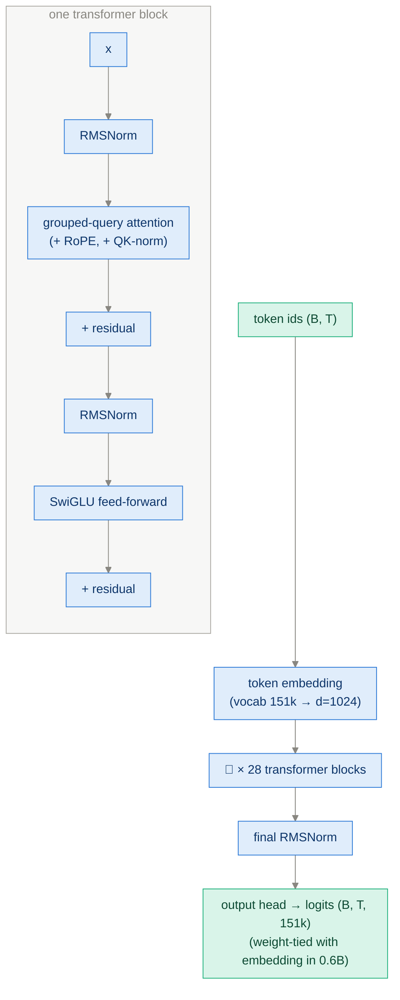
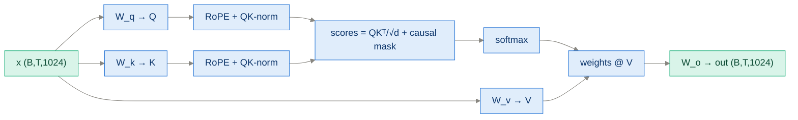
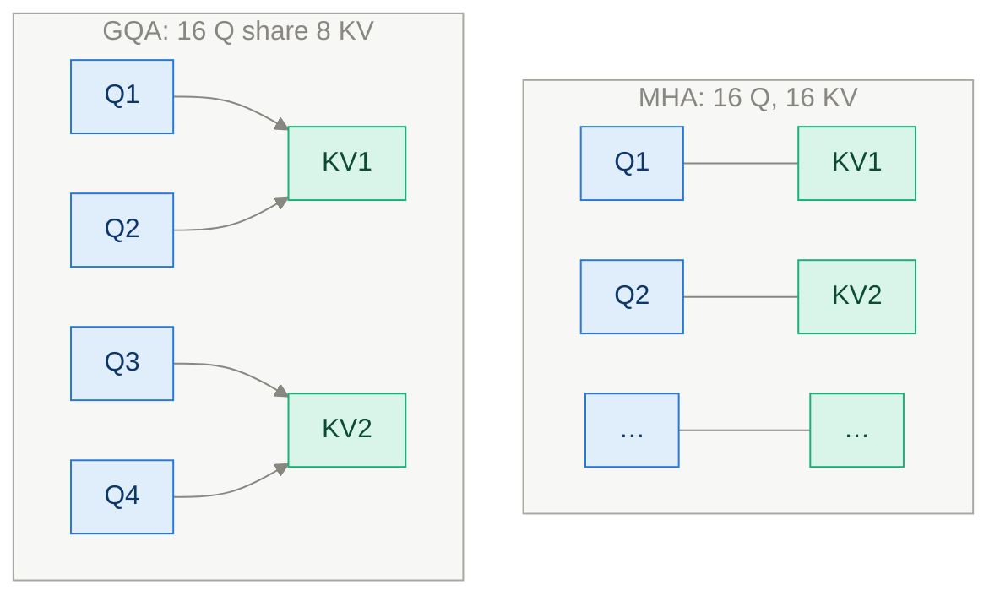

# App C+D · The Qwen3 Architecture, Block by Block (and Scaling It Up)

> **Goal of this module:** open the black box from Ch 2. Every component of the
> Qwen3 transformer — embeddings, RMSNorm, RoPE, grouped-query attention,
> SwiGLU — explained simple-first, with the data shapes at every step, plus
> what changes when you swap in larger Qwen3 models (Appendix D).

**Prerequisites:** PyTorch basics. Pairs naturally with [Ch 2](ch02_generating_text.md).

---

## 1. The whole model at a glance



Qwen3-0.6B vitals (the book's workhorse):

| Property | Value | Meaning |
|---|---|---|
| Parameters | ~0.6 B | small enough for a laptop GPU |
| Layers | 28 | transformer blocks stacked |
| Hidden size d | 1024 | width of every token's vector |
| Attention heads | 16 query heads / **8 KV heads** | grouped-query attention (GQA) |
| Head dim | 128 | note: 16×128 = 2048 ≠ 1024 — attention projects *wider* than the residual stream, one of Qwen3's quirks |
| FFN inner size | 3072 | SwiGLU expansion |
| Vocab | ~151k | BPE tokens |
| Context | 32k+ | via RoPE |

The design is the modern "Llama-style" recipe: **pre-norm residual blocks,
RMSNorm, RoPE, GQA, SwiGLU, no biases**. Learn it once, and you've learned
Llama, Mistral, Gemma, Qwen — they differ mainly in numbers, not structure.

---

## 2. Embeddings — ids become vectors

A lookup table `(vocab_size, d)`. Token id 3838 → row 3838, a learned
1024-dim vector.

```python
self.tok_emb = nn.Embedding(vocab_size, emb_dim)
x = self.tok_emb(token_ids)          # (B, T) → (B, T, 1024)
```

Note what's *missing*: no positional embedding added here. Position enters
later, inside attention, via RoPE (§4.3).

**Weight tying (0.6B):** the output head reuses the embedding matrix
transposed (`logits = x @ E.T`). Saves 151k×1024 ≈ 155M parameters — a huge
fraction of a small model. Larger Qwen3 models untie.

---

## 3. RMSNorm — keeping activations sane

Every block normalizes before attention and before the FFN (**pre-norm** —
gradients flow through the residual stream unimpeded, enabling deep stacks
without warmup gymnastics).

LayerNorm subtracts mean and divides by std. **RMSNorm drops the
mean-subtraction** — just rescale by the root-mean-square, then apply a learned
gain:

$$\text{RMSNorm}(x) = \frac{x}{\sqrt{\tfrac{1}{d}\sum_i x_i^2 + \varepsilon}} \cdot \gamma$$

```python
class RMSNorm(nn.Module):
    def __init__(self, dim, eps=1e-6):
        super().__init__()
        self.weight = nn.Parameter(torch.ones(dim))   # γ, learned gain
        self.eps = eps
    def forward(self, x):
        rms = torch.rsqrt(x.pow(2).mean(-1, keepdim=True) + self.eps)
        return (x * rms) * self.weight
```

Why prefer it: one fewer statistic to compute, no bias parameter, empirically
equal quality — the "same result, less machinery" trade that modern
architectures keep making.

---

## 4. Attention — the heart

### 4.1 Plain causal self-attention in 60 seconds

Each token builds three vectors — **query** ("what am I looking for?"),
**key** ("what do I contain?"), **value** ("what do I give if attended to") —
and each position mixes the values of all *earlier* positions, weighted by
query·key similarity:

$$\text{Attn}(Q,K,V) = \text{softmax}\!\Big(\frac{QK^\top}{\sqrt{d_k}} + M\Big)V$$

- `√d_k` keeps dot products from blowing up the softmax.
- `M` is the **causal mask**: −∞ above the diagonal so position *t* cannot see
  the future. This mask is *why* one forward pass yields a valid next-token
  prediction at every position (training) and why generation works at all.



### 4.2 Multi-head → grouped-query attention (GQA)

**Multi-head:** run attention h times in parallel with smaller dims; different
heads learn different relation types. **GQA:** give every *pair* of query
heads one *shared* K/V head — Qwen3-0.6B: 16 Q heads, 8 KV heads.



Why? **The KV cache** (Appendix E). At inference, cached K/V dominate memory;
halving KV heads halves that cache with near-zero quality loss. GQA is an
inference-economics decision that lives in the architecture.

### 4.3 RoPE — position as rotation

Instead of adding position vectors, **rotate** each (q, k) pair of dimensions
by an angle proportional to its position: dimension pair j at position t is
rotated by t·θⱼ, with θⱼ spanning fast-to-slow frequencies.

The magic: a rotated dot product q_t·k_s depends only on the **relative
offset t−s**. Attention naturally becomes translation-aware, and context can
be extended by rescaling frequencies.

```python
# conceptually, per 2D pair (x1, x2) at position t with frequency θ:
x1' = x1 * cos(t*θ) - x2 * sin(t*θ)
x2' = x1 * sin(t*θ) + x2 * cos(t*θ)
```

> ⚠️ Applied to **Q and K only** — V is not rotated (position should influence
> *matching*, not the content that gets mixed).

### 4.4 QK-norm — Qwen3's stability tweak

Qwen3 applies RMSNorm to queries and keys (per head) *before* RoPE. It bounds
attention logits, preventing the score explosions that destabilize training.
Cheap, effective, increasingly standard.

---

## 5. SwiGLU feed-forward — the knowledge store

Two-thirds of the parameters live here. Old recipe: `Linear → GELU → Linear`.
Modern recipe — **gated**:

$$\text{FFN}(x) = W_{down}\big(\, \text{SiLU}(W_{gate}\,x) \odot W_{up}\,x \,\big)$$

```python
class SwiGLU(nn.Module):
    def __init__(self, dim, hidden):                 # 1024 → 3072 → 1024
        super().__init__()
        self.gate = nn.Linear(dim, hidden, bias=False)
        self.up   = nn.Linear(dim, hidden, bias=False)
        self.down = nn.Linear(hidden, dim, bias=False)
    def forward(self, x):
        return self.down(F.silu(self.gate(x)) * self.up(x))
```

Intuition: `up` proposes content, `silu(gate)` decides *how much of each
channel passes* (a learned, input-dependent valve), `down` projects back.
Gating consistently beats plain MLPs at equal parameter count.

---

## 6. Shapes end-to-end (follow one batch through)

| Stage | Shape | Notes |
|---|---|---|
| token ids | (B, T) | integers |
| after embedding | (B, T, 1024) | the residual stream |
| Q per block | (B, 16, T, 128) | 16 heads |
| K, V per block | (B, 8, T, 128) | 8 KV heads (GQA) |
| attention out | (B, T, 2048) → W_o → (B, T, 1024) | back to stream width |
| FFN inner | (B, T, 3072) | SwiGLU |
| final logits | (B, T, 151k) | Ch 2 uses `[:, -1, :]` |

The **residual stream** view: 28 blocks each *read* from a 1024-dim channel
(via norms/projections) and *write back* additive updates. Attention moves
information *between positions*; FFN transforms it *within* a position.

---

## 7. Appendix D — scaling to larger Qwen3 models

The beautiful part: **the code doesn't change — only the config dict.**

| Model | Layers | d | Q/KV heads | Roughly needs (bf16, weights) |
|---|---|---|---|---|
| 0.6B | 28 | 1024 | 16/8 | ~1.5 GB |
| 1.7B | 28 | 2048 | 16/8 | ~4 GB |
| 4B | 36 | 2560 | 32/8 | ~8 GB |
| 8B | 36 | 4096 | 32/8 | ~16 GB |
| 14B/32B… | ↑ | ↑ | ↑ | multi-GPU territory |

Practical levers when you scale up:

- **Precision:** bf16 halves memory vs fp32 with negligible quality loss on
  modern GPUs; quantization (int8/int4) goes further for inference-only.
- **Base vs. "thinking" variants:** larger official Qwen3 releases come
  reasoning-tuned; loading one gives you a ready teacher for
  [Ch 8 distillation](ch08_distillation.md).
- **Expect every experiment's constants to shift:** bigger models need fewer
  samples for the same maj@N accuracy (Ch 4) and give RL a richer behavior
  space to reinforce (Ch 6).

---

## ⚠️ Common pitfalls

- **Adding positional embeddings AND RoPE** — position gets encoded twice; RoPE replaces additive positions entirely.
- **Rotating V with RoPE** — only Q and K.
- **Wrong RoPE base/frequency config when loading pretrained weights** → model runs but outputs degrade subtly with length. Configs must match the checkpoint exactly.
- **Forgetting the causal mask** in a from-scratch implementation → the model "predicts" tokens it can already see; training loss looks miraculous, generation is garbage.
- **Assuming head_dim = d/n_heads** — Qwen3-0.6B violates this (128 ≠ 1024/16); read dims from the config, don't derive them.
- **Loading fp32 by default** and wondering why 0.6B eats 2.4 GB — load bf16.

---

## ✅ Self-check

<details><summary>1. Why does GQA exist, and what does it trade?</summary>

It shrinks the KV cache (the dominant inference memory cost) by sharing each
K/V head across several query heads — 0.6B halves KV memory (8 KV vs 16 Q
heads). Trade: slightly less expressive attention, empirically near-free.
</details>

<details><summary>2. How does RoPE encode position, and why is "relative" the key word?</summary>

It rotates Q and K by position-proportional angles per frequency pair, so
post-rotation dot products depend only on the token offset t−s. Attention thus
generalizes across absolute positions and extends to longer contexts by
frequency rescaling.
</details>

<details><summary>3. What two distinct jobs do attention and the FFN perform in the residual-stream picture?</summary>

Attention routes information *between* positions (token t gathers from earlier
tokens); the FFN computes *within* a position (transforming each token's
vector independently — where most "knowledge" parameters live).
</details>

<details><summary>4. Name Qwen3's two normalization-related choices and their shared motivation.</summary>

RMSNorm everywhere (pre-norm) and QK-norm on queries/keys before RoPE. Both
exist to keep activations/attention logits bounded for stable training of deep
stacks.
</details>

---

## 🔗 Where this connects

- **Uses this model:** [Ch 2 · Generating Text](ch02_generating_text.md).
- **Why GQA pays off:** [App E · KV Cache & Batching](appendix_kv_cache_batching.md).
- **Index:** [README](../README.md)
