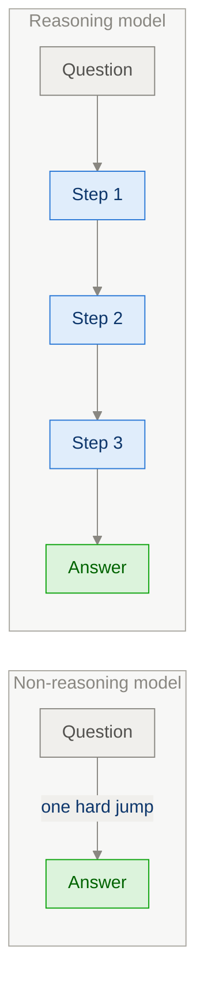
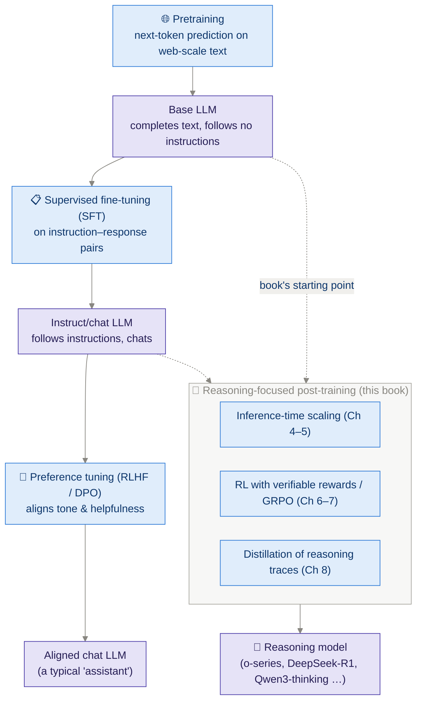
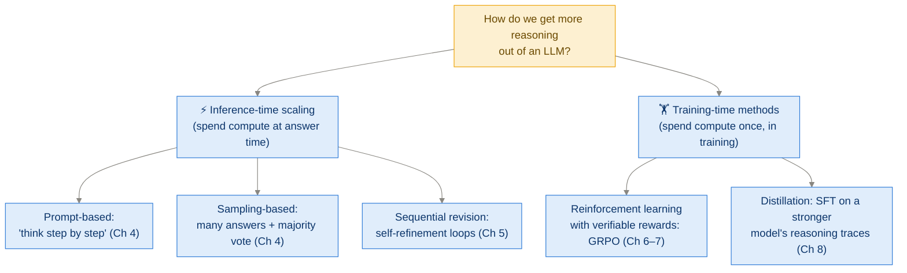
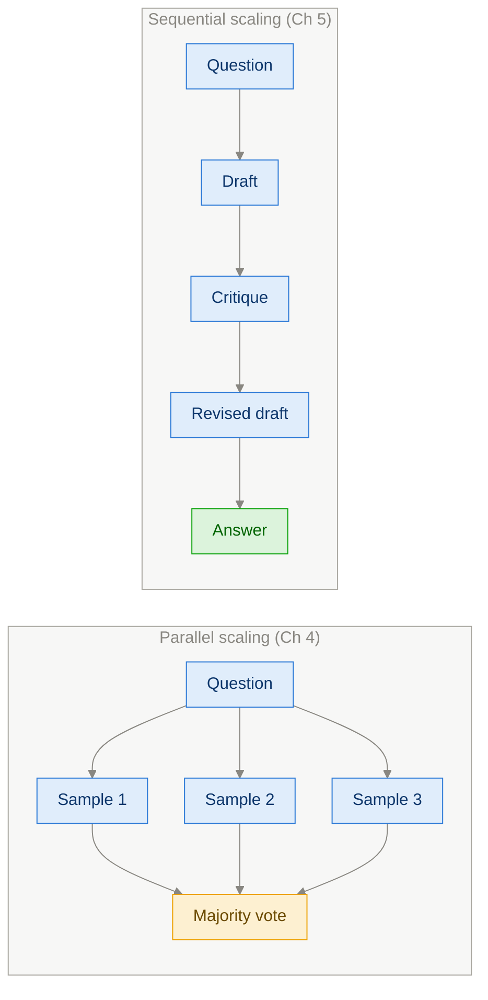
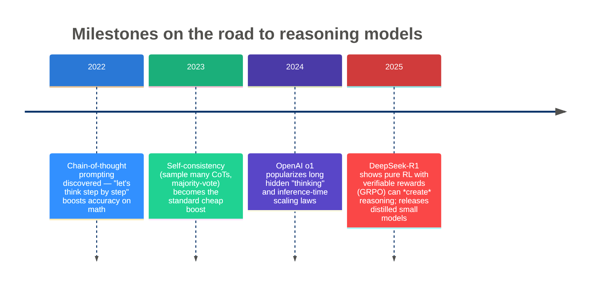
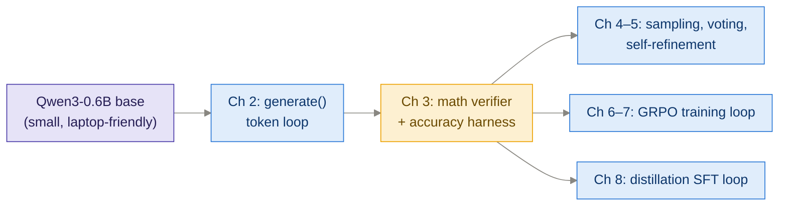

# Ch 1 · Understanding Reasoning Models

> **Goal of this module:** know precisely what "reasoning" means for an LLM,
> where reasoning models sit in the LLM training pipeline, and the two big
> families of methods (inference-time vs. training-time) the rest of the book
> implements.

**Prerequisites:** none. This is the conceptual foundation.

---

## 1. Start simple: what problem are we solving?

Ask a plain LLM: *"Roger has 5 tennis balls. He buys 2 cans of 3 balls each.
How many balls does he have?"*

A **non-reasoning** completion jumps straight to an answer:

```
Answer: 8   ❌ (guessed, wrong)
```

A **reasoning** completion produces intermediate steps first:

```
He starts with 5 balls.
2 cans × 3 balls = 6 new balls.
5 + 6 = 11.
Answer: 11  ✅
```

**Definition used throughout the book:**

> **Reasoning** = generating *intermediate steps* (a "chain of thought", CoT)
> before the final answer, such that the final answer becomes more likely to be
> correct.

Why does emitting extra tokens help? Because an LLM predicts each token
*conditioned on everything before it*. Intermediate steps decompose one hard
prediction ("the answer is ___") into many easy ones. The model is writing its
own scratchpad.



### ⚠️ Important nuance

"Reasoning" here is a **behavioral** definition, not a claim about
consciousness or human-like thought. The chain of thought is *text that
correlates with correctness* — it may even contain errors while the final
answer is right, or look flawless while the answer is wrong. Treat it as a
useful computational pattern, not a transcript of a mind.

---

## 2. Where reasoning models fit in the LLM pipeline



Things to notice:

- **Reasoning training is post-training.** It starts from an already-pretrained
  model. Pretraining gives raw knowledge; reasoning methods *elicit and
  strengthen* multi-step behavior.
- **RLHF ≠ RLVR.** Classic RLHF optimizes a *learned* reward model of human
  preferences (subjective: style, helpfulness). Reasoning RL (Ch 6) uses
  **verifiable rewards** — objective, automatic checks of the final answer.
  Same RL machinery, totally different reward source.

---

## 3. The two method families (the book's table of contents in disguise)



Memorize the distinction on one axis: **when is the extra compute spent?**

| | Inference-time | Training-time |
|---|---|---|
| Weights change? | No | Yes |
| Cost recurs per query? | Yes ⚠️ | No |
| Can exceed base model's latent ability? | No | Yes (RL) / up to teacher (distillation) |
| Examples in the wild | o1 "thinking longer", self-consistency | DeepSeek-R1 (GRPO), R1-Distill models |

### Parallel vs. sequential inference-time scaling

Within inference-time scaling there is a second useful axis:



- **Parallel:** independent samples, aggregate at the end. Trivially parallelizable.
- **Sequential:** each step depends on the previous output. Can fix errors, but latency stacks up.

---

## 4. A brief history you should be able to reproduce from memory



The DeepSeek-R1 result is the intellectual heart of the book's Part 3: starting
from a *base* model and rewarding **only final-answer correctness**, long
chains of thought, self-checking, and "aha moment" backtracking **emerged on
their own**. Nobody wrote "please double-check your work" into the training
data.

---

## 5. What reasoning models are good and bad at

| ✅ Shine at | ❌ Overkill / weak at |
|---|---|
| Math word problems, competition math | Simple factual lookup ("capital of France") |
| Code generation & debugging | Casual conversation |
| Multi-step logic puzzles | Tasks with no checkable structure |
| Scientific / symbolic derivations | Latency-critical applications (thinking = tokens = time = money) |

Two practical costs to remember:

1. **Token cost:** reasoning models may emit thousands of "thinking" tokens per
   query. You pay for those.
2. **Overthinking:** models can ramble past the correct answer and talk
   themselves out of it — a real failure mode addressed by refinements in Ch 7
   and by efficient-reasoning distillation in Ch 8.

---

## 6. The book's concrete plan (what you'll actually build)



Why a 0.6B model? Because *from scratch* means running everything yourself:
small enough for a single GPU (or even CPU patience), big enough to show real
reasoning gains. Appendix D shows the same code scales to larger Qwen3 models.

---

## ⚠️ Common pitfalls & misconceptions

- **"Reasoning models think like humans."** No — behavioral definition only. CoT is correlated computation, not introspection.
- **"More thinking is always better."** Accuracy vs. tokens curves flatten (and can dip — overthinking). Ch 4 plots this.
- **"RLHF made models reason."** RLHF aligns style/preferences. Reasoning came from CoT prompting + RL with *verifiable* rewards + distillation.
- **"You need a huge model."** The book's entire point: the *methods* are model-size-agnostic; a 0.6B model demonstrates them all.

---

## ✅ Self-check

<details><summary>1. Define a reasoning model in one sentence without using the word "think".</summary>

An LLM that generates intermediate solution steps before its final answer,
which measurably increases the probability the final answer is correct.
</details>

<details><summary>2. Why can intermediate tokens raise accuracy, mechanically?</summary>

Each generated token becomes part of the conditioning context for the next
prediction. Steps decompose one hard prediction into a sequence of easier
conditional predictions — the model builds its own scratchpad context.
</details>

<details><summary>3. Classify: (a) majority voting, (b) GRPO, (c) distillation, (d) "think step by step" — into inference-time vs. training-time.</summary>

(a) inference-time (parallel), (b) training-time (RL), (c) training-time
(supervised), (d) inference-time (prompt-based).
</details>

<details><summary>4. What was remarkable about DeepSeek-R1-Zero for this book's narrative?</summary>

Reasoning behaviors (long CoT, self-verification, backtracking) *emerged* from
pure RL with only final-answer correctness rewards on a base model — no
human-written reasoning demonstrations needed. This validates the Ch 6–7
approach.
</details>

---

## 🔗 Where this connects

- **Next:** [Ch 2 · Generating Text with a Pretrained LLM](ch02_generating_text.md) — get the base model talking.
- **Deep dive:** [App C+D · Qwen3 Architecture](appendix_qwen3_architecture.md) if you want to know what's inside the model first.
- **Back:** [00 · Big Picture](00_big_picture.md)
