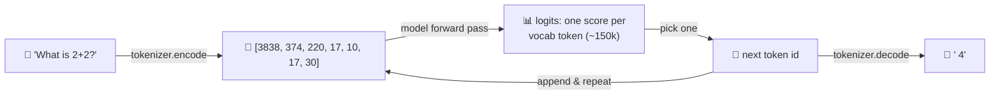
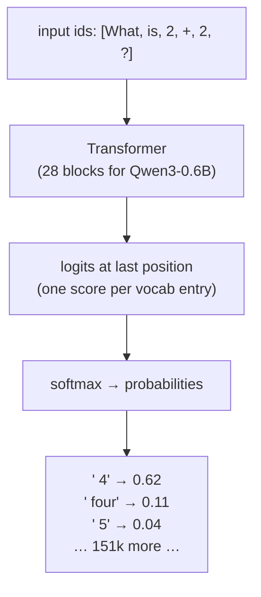
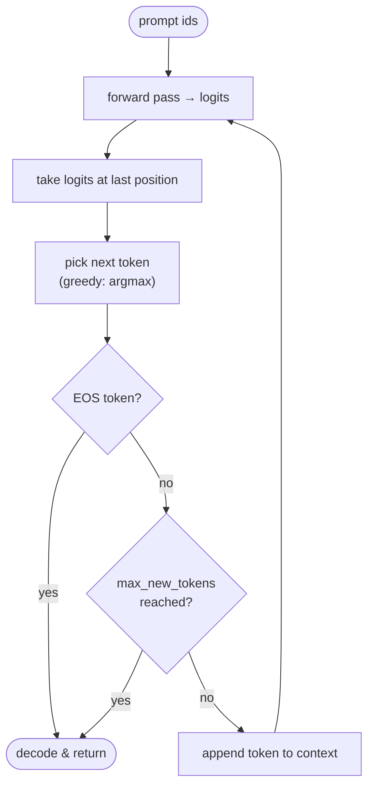

# Ch 2 · Generating Text with a Pretrained LLM

> **Goal of this module:** understand every arrow in the path
> `string → tokens → model → logits → next token → string`, and build the
> `generate()` loop that every later chapter reuses.

**Prerequisites:** [Ch 1](ch01_understanding_reasoning_models.md). PyTorch basics.
**Feeds into:** literally everything — Ch 3 (evaluation calls `generate()`),
Ch 4–5 (sampling variants of it), Ch 6–7 (RL rollouts are `generate()` calls).

---

## 1. The 10,000-ft view



Three components, three subsections:

1. **Tokenizer** — text ↔ integer ids
2. **Model** — ids → logits (a score for every possible next token)
3. **Decoding loop** — logits → chosen token, appended, repeat

---

## 2. Tokenization: text ↔ integers

LLMs don't see characters or words; they see **subword tokens** from a fixed
vocabulary (Qwen3: ~151k entries) learned with **byte-pair encoding (BPE)**.
BPE starts from bytes and repeatedly merges the most frequent adjacent pair, so
common words become single tokens and rare words split into pieces:

```
"unbelievable"  →  ["un", "believ", "able"]     (3 tokens)
"the"           →  ["the"]                      (1 token)
"Qwen3"         →  ["Q", "wen", "3"]            (3 tokens)
```

```python
ids  = tokenizer.encode("What is 2+2?")   # [3838, 374, 220, 17, 10, 17, 30]
text = tokenizer.decode(ids)              # "What is 2+2?" (lossless round-trip)
```

Why you must care in *this* book specifically:

- **Token counts = cost.** Inference-time scaling (Ch 4–5) multiplies them.
- **Numbers tokenize weirdly** (`"1234"` may be `"12","34"`), part of why
  arithmetic is hard for LLMs and why step-by-step helps.
- **Special tokens** mark structure. Qwen3's chat format uses
  `<|im_start|>` / `<|im_end|>` delimiters and `<|endoftext|>`; the reasoning
  variants also use `<think>` … `</think>` to fence off the chain of thought.

### Chat templates — the part everyone underestimates

A base model just continues text. A *chat* requires wrapping messages in the
exact template the model was trained with:

```
<|im_start|>user
What is 2+2?<|im_end|>
<|im_start|>assistant
```

The model then completes the assistant turn and (if well-behaved) emits
`<|im_end|>`, which we treat as a stop signal.

> ⚠️ **Pitfall #1 of the whole book:** using the wrong/missing chat template
> silently degrades a model into rambling text-completion mode. If output looks
> like the model is "talking to itself", check the template first.

---

## 3. The model: ids → logits

Full architecture internals live in
[App C+D · Qwen3 Architecture](appendix_qwen3_architecture.md). For this
chapter you only need the black-box contract:

```python
logits = model(input_ids)        # shape: (batch, seq_len, vocab_size)
next_token_logits = logits[:, -1, :]   # we only need the LAST position
```

- The model outputs a logit vector **at every position**, i.e. a prediction of
  "what comes next" after each prefix. For generation we use only the last one.
- `softmax(logits)` turns scores into probabilities over the whole vocabulary.



---

## 4. The generation loop (the most reused code in the book)

**Autoregressive generation** = call the model, pick a token, append it, call
again. One token per forward pass.

```python
@torch.no_grad()                              # inference: no gradients needed
def generate(model, token_ids, max_new_tokens, eos_token_id=None):
    for _ in range(max_new_tokens):
        logits = model(token_ids)             # (1, seq_len, vocab)
        next_logits = logits[:, -1, :]        # predictions after last token
        next_id = torch.argmax(next_logits, dim=-1, keepdim=True)  # GREEDY
        if eos_token_id is not None and next_id.item() == eos_token_id:
            break                             # model chose to stop
        token_ids = torch.cat([token_ids, next_id], dim=1)  # append & repeat
    return token_ids
```

Line-by-line, what matters:

| Line | Why it's there |
|---|---|
| `torch.no_grad()` | Generation needs no gradients → big memory/speed win. (In Ch 6 RL we'll need log-probs *with* grads for the update step — different code path.) |
| `logits[:, -1, :]` | Only the final position predicts the *next* token. |
| `argmax` | **Greedy decoding**: always the single most likely token. Deterministic. Replaced by sampling in Ch 4. |
| `eos` check | Stop when the model emits its end token (`<|im_end|>` / `<|endoftext|>`); otherwise it will happily ramble to `max_new_tokens`. |
| `torch.cat` | The appended token becomes context for the next step — this is what "autoregressive" means. |



### Why is this slow? (and the fix)

Each iteration re-processes the **entire** sequence from scratch — O(n²)-ish
work over the generation. The fix, the **KV cache** (reuse attention
keys/values from previous steps), is
[Appendix E's](appendix_kv_cache_batching.md) topic. Concept now, speed later.

---

## 5. Base model vs. reasoning model — the Ch 2 experiment

The chapter's payoff experiment: run the *same* question through
**Qwen3-0.6B-base** and the **reasoning-tuned** variant.

| | Base model | Reasoning variant |
|---|---|---|
| Output style | Short completion, may just continue the text | `<think> … long deliberation … </think>` then the answer |
| Correctness on math | Hit-or-miss | Noticeably better |
| Tokens used | Few | Many (thinking costs tokens) |

This before/after gap **is the book's motivating measurement**: Chapters 4–8
are five different ways to close it starting from the base model yourself.

---

## 6. Putting it together, end to end

```python
prompt = format_chat(user="Which is larger, 9.9 or 9.11?")   # apply template!
ids = torch.tensor([tokenizer.encode(prompt)])
out = generate(model, ids, max_new_tokens=512,
               eos_token_id=tokenizer.eos_token_id)
print(tokenizer.decode(out[0, ids.shape[1]:]))   # decode ONLY the new tokens
```

> Note `out[0, ids.shape[1]:]` — slice off the prompt, decode only the
> completion. Classic off-by-prompt bug otherwise.

---

## ⚠️ Common pitfalls

- **Missing chat template** → gibberish/self-conversation (see §2).
- **Forgetting `eos` handling** → answers followed by hallucinated new questions.
- **Decoding prompt+completion together** and thinking the model "repeated the question".
- **`model.train()` left on** → dropout active during generation → noisy output. Always `model.eval()`.
- **Assuming greedy = best.** Greedy is deterministic and fine for a baseline, but Ch 4 shows diverse *sampling* + voting beats a single greedy answer on reasoning tasks.

---

## ✅ Self-check

<details><summary>1. Why does generation only use <code>logits[:, -1, :]</code> when the model computes logits at every position?</summary>

The logit vector at position *t* is the model's prediction for token *t+1*.
During generation we already know tokens 1…t; the only unknown is the next
one, predicted at the last position. (The other positions' logits are exactly
what training uses — next-token prediction at every position in parallel.)
</details>

<details><summary>2. What two conditions terminate the generation loop?</summary>

The model emits the EOS/end-of-turn token, or the `max_new_tokens` budget is
exhausted.
</details>

<details><summary>3. Your model answers questions but then continues with "User: …" and invents a conversation. Diagnose.</summary>

EOS/stop-token handling is missing or the wrong stop id is used (e.g. checking
`<|endoftext|>` when the chat format ends turns with `<|im_end|>`), so the
model keeps completing the transcript pattern it learned.
</details>

<details><summary>4. Why is greedy decoding a poor basis for majority voting?</summary>

Greedy is deterministic — every run yields the identical answer, so "voting"
over N identical samples adds nothing. Voting needs the diversity that
temperature/top-k sampling provides (Ch 4).
</details>

---

## 🔗 Where this connects

- **Next:** [Ch 3 · Evaluating Reasoning Models](ch03_evaluating_reasoning.md) — wrap `generate()` in an accuracy harness.
- **Inside the black box:** [App C+D · Qwen3 Architecture](appendix_qwen3_architecture.md).
- **Make it fast:** [App E · KV Cache & Batching](appendix_kv_cache_batching.md).
- **Back:** [Ch 1](ch01_understanding_reasoning_models.md) · [Index](../README.md)
