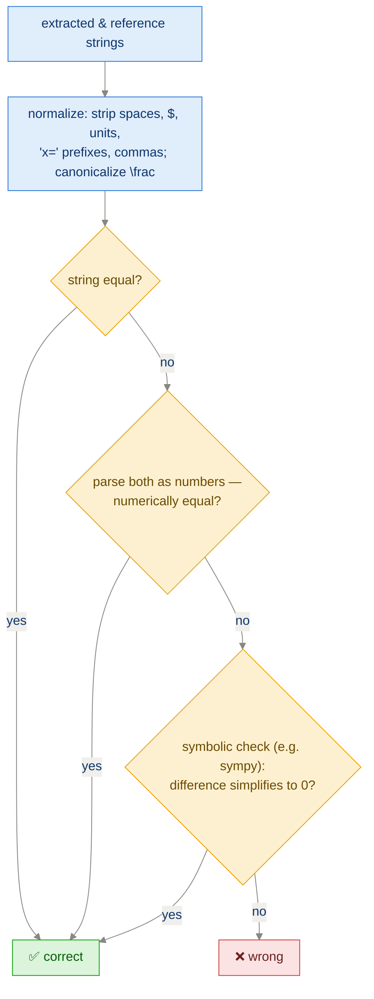

# Ch 3 · Evaluating Reasoning Models

> **Goal of this module:** build the *verifier* — automatic checking of a
> model's final answer against ground truth — and understand why this one piece
> of plumbing powers both **measurement** (all chapters) and **training**
> (the GRPO reward in Ch 6).

**Prerequisites:** [Ch 2](ch02_generating_text.md) (`generate()`).
**Feeds into:** Ch 4–5 (comparing methods), Ch 6–7 (the verifier IS the reward function), Ch 8 (checking distillation gains).

---

## 1. Why evaluation comes before improvement

You cannot claim a method "improves reasoning" without a number that goes up.
The book's chosen number:

> **Accuracy on math problems whose final answer can be checked automatically.**

Math is the perfect first domain because:

| Property | Why it matters |
|---|---|
| Single well-defined answer | No human judgment needed |
| Cheap equality check | Evaluate thousands of generations for free |
| Difficult for small LLMs | Lots of headroom to demonstrate improvement |
| Doubles as an RL reward | The same check drives GRPO training in Ch 6 |

This is the idea of **verifiable rewards** (as in RLVR — *reinforcement
learning with verifiable rewards*): the grader is a program, not a person or a
learned model, so it never gets tired, never drifts, and can't easily be
sweet-talked (though it *can* be gamed — see §5).

---

## 2. The evaluation pipeline

```mermaid
%%{init: {"theme":"base","themeVariables":{"primaryColor":"#e0edfb","primaryTextColor":"#0d366b","primaryBorderColor":"#2a78d6","lineColor":"#898781","textColor":"#52514e","edgeLabelBackground":"#f0efec","clusterBkg":"rgba(137,135,129,0.07)","clusterBorder":"#a9a7a0","titleColor":"#898781"},"flowchart":{"nodeSpacing":36,"rankSpacing":44,"curve":"basis","padding":10}}}%%
flowchart LR
    DS[("📚 Math dataset<br/>question + reference answer")] --> Q["question"]
    Q -->|"format prompt<br/>(ask for \boxed{...})"| P["prompt"]
    P -->|"generate() from Ch 2"| G["model output:<br/>reasoning + final answer"]
    G -->|extract| EX["extracted answer<br/>e.g. '11'"]
    DS --> REF["reference answer<br/>e.g. '11'"]
    EX --> V{"verifier:<br/>equivalent?"}
    REF --> V
    V -- yes --> C1["✅ correct += 1"]
    V -- no --> C0["❌"]
    C1 & C0 --> ACC["accuracy = correct / total"]
    classDef data fill:#d9f4e9,stroke:#1baf7a,color:#0b4a33
    classDef dec fill:#fdf0d1,stroke:#eda100,color:#6b4a00
    classDef good fill:#dcf3dc,stroke:#0ca30c,color:#006300
    classDef bad fill:#fbe3e3,stroke:#d03b3b,color:#6d1f1f
    class DS,REF,EX data
    class V dec
    class C1,ACC good
    class C0 bad
```



Four sub-problems, each deceptively tricky:

1. **Dataset** — e.g. MATH-500-style problems: competition-style questions with a short verifiable answer.
2. **Prompt format** — instruct the model to put its final answer in a fixed, findable place, conventionally `\boxed{...}`.
3. **Answer extraction** — parse the completion to pull out that final answer.
4. **Equivalence checking** — decide whether `extracted == reference`, allowing formatting differences.

---

## 3. Answer extraction (the parsing problem)

The model's output is free text. We need the answer *string* out of it:

```python
def extract_final_answer(text):
    # Find the LAST \boxed{...} — models sometimes box intermediate results
    start = text.rfind(r"\boxed{")
    if start == -1:
        return None                      # no boxed answer = automatically wrong
    # Walk forward matching braces (answers may contain nested { })
    i, depth = start + len(r"\boxed{"), 1
    out = []
    while i < len(text) and depth > 0:
        c = text[i]
        if c == "{": depth += 1
        elif c == "}": depth -= 1
        if depth > 0: out.append(c)
        i += 1
    return "".join(out).strip()
```

Design decisions worth internalizing:

- **Take the last box, not the first** — reasoning traces often box
  intermediate values.
- **Brace matching, not regex `\boxed{(.*?)}`** — answers like
  `\boxed{\frac{1}{2}}` contain nested braces; the lazy regex truncates them.
- **`None` ⇒ wrong.** If the model didn't follow the format, it scores 0. This
  couples *formatting ability* into the metric — a known and accepted bias
  (and in Ch 6/7 it becomes a deliberate *format reward*).

---

## 4. Equivalence checking (the "grading" problem)

Exact string match is too strict:

| Model said | Reference | Same? |
|---|---|---|
| `0.5` | `1/2` | ✅ mathematically |
| `\frac{1}{2}` | `1/2` | ✅ |
| ` 42 ` | `42` | ✅ (whitespace) |
| `x=5` | `5` | ✅-ish (prefix noise) |
| `3,600` | `3600` | ✅ (thousands separator) |

So the verifier normalizes both sides, then compares on multiple levels:



> **Principle: graded leniency.** Try cheap exact checks first, fall back to
> more expensive/permissive ones. Every leniency rule you add fixes some false
> negatives and risks new false positives — verifiers are engineering, not
> plumbing. Spot-check disagreements by hand.

---

## 5. What accuracy numbers actually mean

### Sources of noise you must control

| Noise source | Control |
|---|---|
| Sampling randomness | Use greedy decoding for eval, or fix seeds / average over runs |
| Answer-format failures | Report "no boxed answer" rate separately — it explains many "wrong" answers |
| Small eval sets | 500 problems ⇒ ±~2–4% swings are normal; don't celebrate +1% |
| Truncation | If `max_new_tokens` cuts off thinking, the answer never appears → silent accuracy loss |

### Goodhart's law preview (critical for Ch 6!)

When this verifier becomes the **RL reward**, the model will exploit any gap
between *"passes the verifier"* and *"actually correct reasoning"*:

- Learns to always emit `\boxed{}` (good — format reward working)
- Might learn to guess common answers (0, 1, 2…) if the dataset is skewed
- Might produce nonsense reasoning with a memorized final answer

**A metric that's merely "pretty good" for evaluation must be hardened before
it becomes a training signal.** Keep this in your head until Ch 6–7.

---

## 6. The harness

```python
def evaluate(model, tokenizer, dataset, max_new_tokens=1024):
    correct = 0
    for ex in dataset:
        prompt = format_math_prompt(ex["question"])     # asks for \boxed{}
        completion = generate_text(model, tokenizer, prompt, max_new_tokens)
        pred = extract_final_answer(completion)
        if pred is not None and grade(pred, ex["answer"]):
            correct += 1
    return correct / len(dataset)
```

This tiny loop is rerun after *every* method in the book — it's the scoreboard.
Baseline it now: run it on the base model **and** on the official
reasoning-tuned variant. The gap between those two numbers is what Part 2 and
Part 3 chase.

---

## ⚠️ Common pitfalls

- **Lazy regex for `\boxed{}`** → truncated `\frac{1}{2}` style answers → fake wrongs.
- **Grading the first boxed answer** instead of the last.
- **`max_new_tokens` too small** → thinking gets cut before the box → model looks worse than it is.
- **Comparing accuracies across different verifiers/prompts.** The metric is only comparable when the entire harness is identical.
- **Treating +1–2% on 500 problems as signal.** It's within noise.

---

## ✅ Self-check

<details><summary>1. Why does the book insist on <i>verifiable</i> evaluation instead of, say, GPT-4-as-judge?</summary>

Verifiable checks are objective, free, reproducible, and fast enough to run
inside a training loop — which is exactly what Ch 6 does when the verifier
becomes the GRPO reward. Judge-models are subjective, cost per call, and can be
gamed by persuasive-sounding text. (LLM-as-judge is covered as a general
technique in Appendix F.)
</details>

<details><summary>2. A model's accuracy jumps from 22% to 25% after a prompt tweak, evaluated once on 500 problems with sampling. Convinced?</summary>

No. With sampling randomness and n=500, ±2–4% is noise. Re-run with greedy
decoding or multiple seeds, check the no-boxed-answer rate didn't change, and
only then compare.
</details>

<details><summary>3. Why must extraction take the <i>last</i> boxed expression?</summary>

Reasoning traces often box intermediate results mid-derivation. The final
answer, by convention and by prompt instruction, is the last one.
</details>

<details><summary>4. Give one way a model could get 100% "reward" from a weak verifier while learning nothing useful.</summary>

E.g., if the equivalence checker accidentally treats `None`/empty as equal, or
if the dataset's answers are mostly "0" and the model learns to always answer
0; or the model finds a formatting exploit that makes the parser compare empty
strings. Weak verifier + RL = reward hacking (Ch 6 §pitfalls).
</details>

---

## 🔗 Where this connects

- **Next:** [Ch 4 · Inference-Time Scaling](ch04_inference_time_scaling.md) — first attempt to raise the score without training.
- **This verifier returns as the reward:** [Ch 6 · GRPO](ch06_grpo_reinforcement_learning.md).
- **Beyond math benchmarks:** [App F · General LLM Evaluation](appendix_evaluation_methods.md).
- **Back:** [Ch 2](ch02_generating_text.md) · [Index](../README.md)
