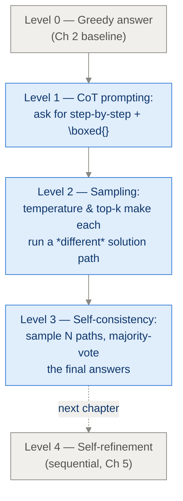
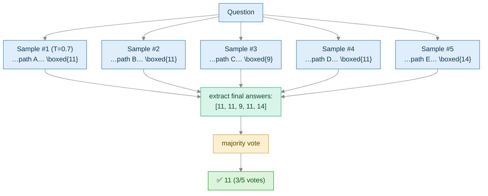
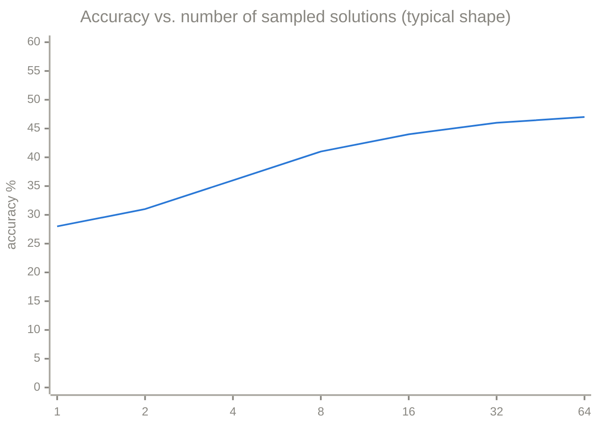

# Ch 4 · Improving Reasoning with Inference-Time Scaling

> **Goal of this module:** raise math accuracy **without touching a single
> weight**, using three stacked ideas: better prompting (CoT), stochastic
> sampling (temperature/top-k), and aggregation (self-consistency / majority
> voting).

**Prerequisites:** [Ch 2](ch02_generating_text.md) (`generate()`), [Ch 3](ch03_evaluating_reasoning.md) (the scoreboard).
**Feeds into:** Ch 5 (sequential variant), Ch 6 (GRPO *rollouts* are exactly this chapter's sampling).

---

## 1. The ladder we climb in this chapter



Each level costs more tokens and buys more accuracy. The chapter's empirical
message: **accuracy is purchasable with inference compute** — up to a ceiling
set by the base model.

---

## 2. Level 1 — Chain-of-thought prompting

The cheapest trick in all of LLM-land: *ask for steps*.

```
Solve the following problem. Think step by step,
then give the final answer in \boxed{}.

Problem: {question}
```

Why it works (recall Ch 1 §1): the requested steps become context tokens that
condition later predictions; the model decomposes one hard prediction into many
easy ones. Modern instruction-tuned models often do this unprompted; *base*
models usually need the nudge.

> Note the dual purpose of `\boxed{}` in the prompt: it improves the model's
> answer formatting **and** makes the Ch 3 extractor's job reliable. Prompt
> design and verifier design are one system.

---

## 3. Level 2 — From greedy to sampling

### 3.1 The problem with greedy

Greedy decoding always picks the argmax token → the **same** answer every time.
If the model's single most-likely path contains one arithmetic slip, you lose,
deterministically. But the model's *distribution* usually contains many other
solution paths, some correct. Sampling explores them.

### 3.2 Temperature — reshaping the distribution

Divide logits by temperature `T` before softmax:

```python
probs = torch.softmax(logits / T, dim=-1)
next_id = torch.multinomial(probs, num_samples=1)   # sample, don't argmax
```

| T | Effect | Use case |
|---|---|---|
| → 0 | Sharpens toward argmax (greedy in the limit) | Deterministic eval |
| 1.0 | Model's raw distribution | Faithful sampling |
| ~0.6–0.8 | Mildly sharpened | **Sweet spot for reasoning diversity** |
| > 1 | Flattens → creative → incoherent | Rarely for math |

```mermaid
%%{init: {"theme":"base","themeVariables":{"xyChart":{"backgroundColor":"transparent","plotColorPalette":"#2a78d6,#1baf7a,#eda100","xAxisLabelColor":"#898781","xAxisTitleColor":"#898781","xAxisTickColor":"#898781","xAxisLineColor":"#a9a7a0","yAxisLabelColor":"#898781","yAxisTitleColor":"#898781","yAxisTickColor":"#898781","yAxisLineColor":"#a9a7a0","titleColor":"#898781"}}}}%%
xychart-beta
    title "Effect of temperature on next-token probabilities (illustrative)"
    x-axis ["' 4'", "' four'", "' 5'", "' the'", "other"]
    y-axis "probability" 0 --> 1
    bar [0.62, 0.11, 0.04, 0.02, 0.21]
    bar [0.85, 0.08, 0.01, 0.005, 0.055]
    bar [0.35, 0.18, 0.12, 0.09, 0.26]
```


*(middle bars: T=0.5 sharpens; last bars: T=1.5 flattens)*

### 3.3 Top-k — cutting off the garbage tail

With ~151k vocab entries, even tiny per-token probabilities on nonsense tokens
add up. **Top-k** keeps only the k most likely tokens, then renormalizes:

```python
topk_logits, topk_idx = torch.topk(logits, k)         # keep best k
mask = torch.full_like(logits, float("-inf"))
logits = mask.scatter(-1, topk_idx, topk_logits)      # -inf everywhere else
probs = torch.softmax(logits / T, dim=-1)             # combine with temperature
```

(Cousin: **top-p / nucleus sampling** — keep the smallest set of tokens whose
cumulative probability ≥ p. Same purpose, adaptive cutoff.)

```mermaid
%%{init: {"theme":"base","themeVariables":{"primaryColor":"#e0edfb","primaryTextColor":"#0d366b","primaryBorderColor":"#2a78d6","lineColor":"#898781","textColor":"#52514e","edgeLabelBackground":"#f0efec","clusterBkg":"rgba(137,135,129,0.07)","clusterBorder":"#a9a7a0","titleColor":"#898781"},"flowchart":{"nodeSpacing":36,"rankSpacing":44,"curve":"basis","padding":10}}}%%
flowchart LR
    LOG["logits (151k values)"] --> TK["top-k filter:<br/>keep k best, rest → -inf"]
    TK --> TEMP["divide by temperature T"]
    TEMP --> SM["softmax"]
    SM --> MN["multinomial sample"]
    MN --> TOKEN["next token"]
    classDef data fill:#d9f4e9,stroke:#1baf7a,color:#0b4a33
    class LOG,TOKEN data
```



> **Order matters little between top-k and temperature, but both come before
> softmax.** And with `T→0` this whole pipeline degenerates to greedy — greedy
> is a special case, which is why one `generate()` with knobs serves the whole
> book.

---

## 4. Level 3 — Self-consistency (majority voting)

**Algorithm:** sample N complete solutions with temperature > 0, extract each
final answer (Ch 3 extractor), and return the most frequent one.



```python
from collections import Counter

def self_consistency(model, tok, prompt, n=8, T=0.7, k=20):
    answers = []
    for _ in range(n):
        text = generate_text(model, tok, prompt, temperature=T, top_k=k)
        ans = extract_final_answer(text)
        if ans is not None:
            answers.append(normalize(ans))
    if not answers:
        return None
    return Counter(answers).most_common(1)[0][0]
```

### Why voting works — the intuition

Different sampled paths make **independent-ish errors**, but correct reasoning
converges on the **same** final answer. Wrong answers scatter (9, 14, -3, …);
the right answer accumulates votes. It's an error-correcting code built from
randomness.

Condition for it to help: the model must be right *more often than any single
wrong answer is produced* — voting amplifies the plurality, whatever it is. A
model that's confidently, systematically wrong gets *more* wrong with voting.

### The scaling curve



- Big early gains (1→8 samples), then **diminishing returns** — the curve
  flattens toward a ceiling determined by the base model's ability.
- Cost is **linear** in N. Pick N where the curve's slope no longer justifies
  the tokens (often 4–16 in practice).

### Two evaluation regimes worth distinguishing

| Metric | Question it answers |
|---|---|
| **maj@N** (self-consistency) | "What accuracy do I get by voting over N samples?" — a *deployable* method |
| **pass@N** | "Was at least one of N samples correct?" — an *upper bound* / capability probe (needs an oracle verifier to select the right one, so not directly deployable) |

pass@N ≥ maj@N always. The gap between them is what *better selection* (e.g.
verifiers, reward models — and Ch 5's refinement) tries to capture.

---

## ⚠️ Common pitfalls

- **Voting over greedy samples** — N identical answers, zero diversity, zero gain. Temperature must be > 0.
- **Voting over raw strings** — `1/2` and `0.5` split their votes unless you normalize answers before counting (reuse the Ch 3 normalizer!).
- **Cranking temperature too high** — paths become incoherent; both accuracy *and* vote coherence drop.
- **Ignoring `None` extractions** — if half the samples have no `\boxed{}`, fix the prompt/format before adding samples.
- **Comparing methods at unequal token budgets** — 1 greedy answer vs. 32 sampled answers is not a fair "method" comparison; report tokens spent.

---

## ✅ Self-check

<details><summary>1. Why does majority voting need temperature > 0?</summary>

Sampling diversity is the raw material. At T=0 (greedy) every sample is
identical, so the vote is over N copies of one answer — pure wasted compute.
</details>

<details><summary>2. Explain the difference between maj@16 and pass@16, and which is always larger.</summary>

maj@16: accuracy of the majority-voted answer over 16 samples — a real method.
pass@16: fraction of problems where *at least one* of 16 samples was correct —
an upper bound requiring oracle selection. pass@16 ≥ maj@16.
</details>

<details><summary>3. When does self-consistency actively hurt?</summary>

When the model is systematically biased toward a specific wrong answer (that
wrong answer wins the vote even when correct paths exist among samples), or
when diversity is so high (huge T) that correct paths become rare.
</details>

<details><summary>4. Where exactly do temperature and top-k plug into the Ch 2 generate loop?</summary>

Between taking `logits[:, -1, :]` and choosing the token: apply top-k masking
to the logits, divide by T, softmax, then `torch.multinomial` instead of
`argmax`.
</details>

---

## 🔗 Where this connects

- **Next:** [Ch 5 · Self-Refinement](ch05_self_refinement.md) — the *sequential* way to spend inference compute.
- **Reused in:** [Ch 6 · GRPO](ch06_grpo_reinforcement_learning.md) — sampling G diverse rollouts per question is the first step of every GRPO update.
- **Make N samples cheap:** [App E · KV Cache & Batching](appendix_kv_cache_batching.md).
- **Back:** [Ch 3](ch03_evaluating_reasoning.md) · [Index](../README.md)
