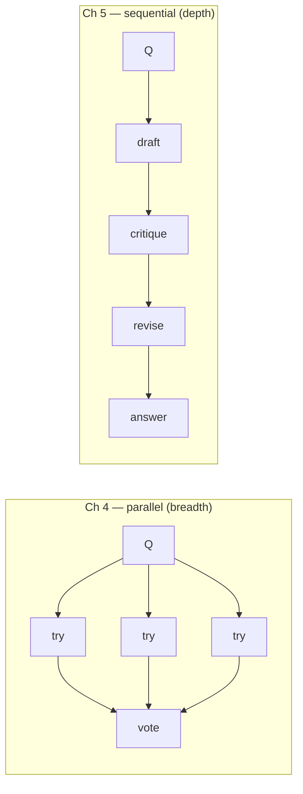
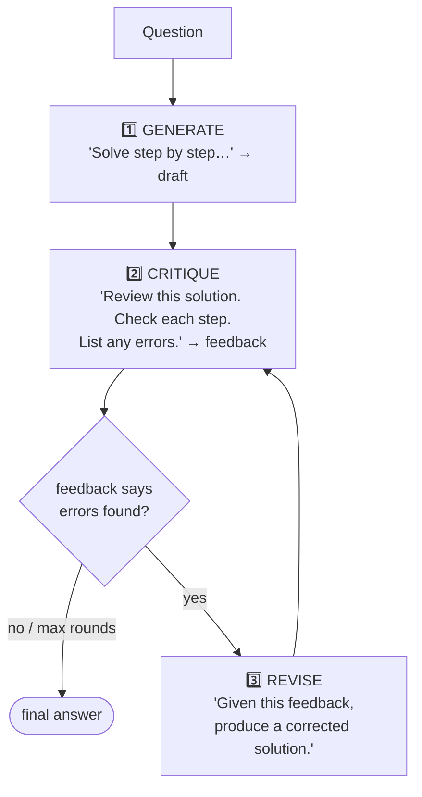
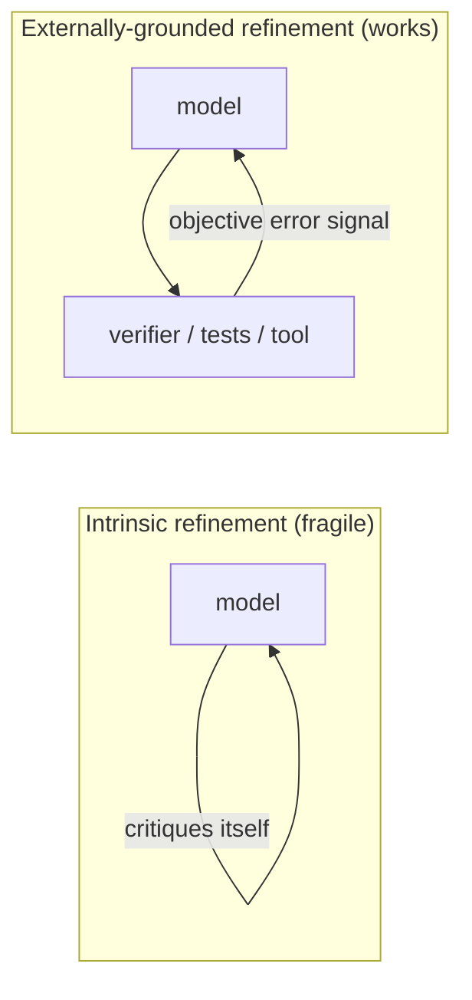
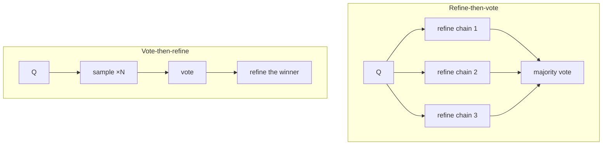

# Ch 5 · Inference-Time Scaling via Self-Refinement

> **Goal of this module:** implement the *sequential* flavor of inference-time
> scaling — the model **critiques its own draft and revises it** — and learn
> when this beats, complements, or loses to parallel voting from Ch 4.

**Prerequisites:** [Ch 4](ch04_inference_time_scaling.md).
**Feeds into:** Ch 6+ (RL-trained models internalize a similar draft→check→revise behavior *inside* one generation).

---

## 1. Parallel vs. sequential — the axis this chapter sits on

Ch 4 spent compute **in parallel**: N independent tries, aggregate at the end.
No sample learns from another. This chapter spends compute **in sequence**:
each step sees, and improves on, the previous output.



| | Parallel (Ch 4) | Sequential (Ch 5) |
|---|---|---|
| Errors are… | out-voted | *repaired* |
| Latency | 1 generation (if batched) | k generations stacked |
| Information flows between tries? | ❌ | ✅ |
| Fails when… | plurality is wrong | the model can't recognize its own errors |

---

## 2. The self-refinement loop

Three prompts, one model, one loop:



```python
def self_refine(model, tok, question, max_rounds=3):
    draft = generate_text(model, tok, solve_prompt(question))
    for _ in range(max_rounds):
        feedback = generate_text(model, tok, critique_prompt(question, draft))
        if looks_clean(feedback):          # e.g. contains "no errors"
            break
        draft = generate_text(model, tok, revise_prompt(question, draft, feedback))
    return draft
```

Design notes:

- **Same model plays all three roles.** Generator, critic, and reviser are just
  different prompts over the same weights. (Using a *stronger* critic model is
  a natural extension — that edges toward distillation territory, Ch 8.)
- **Stopping rule matters.** Fixed round budget + early exit when the critique
  is clean. Unbounded loops burn tokens and can oscillate.
- **The critique must be *specific*.** "Check each step and point to the first
  incorrect one" outperforms "is this right?". Vague critiques produce vague
  (or needless) revisions.

---

## 3. The honest empirical picture

Self-refinement is the most intuitively appealing method in the book and the
most **fragile**. Key findings you should be able to recite:

1. **Self-correction without external signal is weak.** A model that made an
   error is, by construction, likely to *not see* that error when re-reading
   its own work — same weights, same blind spots. Studies (e.g. "Large Language
   Models Cannot Self-Correct Reasoning Yet") show *intrinsic* self-correction
   often changes correct answers to wrong ones as frequently as the reverse.
2. **Refinement with a *reliable* external check works great.** If a verifier,
   unit test, or tool tells the model *that* (or where) it's wrong, revision
   genuinely helps. Signal quality is the whole game.
3. **Small models are worse critics than generators.** For a 0.6B model, the
   critique step is often the weakest link — expect modest or even negative
   gains, and measure (Ch 3 harness!) rather than assume.



> **The bridge to Part 3:** the reliable external signal for math *exists* —
> it's the Ch 3 verifier. But if we're allowed to consult the verifier, why
> merely revise one answer at inference time? We could use it to *train the
> weights* so the model needs less babysitting forever. That is exactly
> Chapter 6.

---

## 4. Combining breadth and depth

The methods compose. Two standard combinations:



Budget thinking: with a fixed budget of ~N total generations, pure voting is a
strong default; add refinement depth only where critiques are trustworthy.
Always compare at **equal token budgets** (Ch 4 pitfall applies doubly here).

---

## ⚠️ Common pitfalls

- **Assuming refinement must help.** Measure. Intrinsic self-critique can *lower* accuracy (flip-flopping correct → incorrect).
- **Sycophantic critic.** Prompted with "find the error", models often invent one even when the draft is right — then "fix" it wrongly. Ask for *verification*, allow "no errors found" as an explicit option.
- **Letting context snowball.** Feeding full history (draft₁, critique₁, draft₂, …) into every round explodes token cost; keep only question + latest draft + latest feedback.
- **No stopping rule** → oscillation between two answers, budget gone.
- **Refining the reasoning but not re-extracting the answer** — final output must still end with `\boxed{}` for the Ch 3 harness.

---

## ✅ Self-check

<details><summary>1. Why is self-refinement called "sequential" scaling while voting is "parallel"?</summary>

Voting's N samples are independent — they can run simultaneously and only meet
at the aggregation step. Refinement's steps are causally chained: the critique
needs the draft, the revision needs the critique. Compute stacks in series
(latency adds up), and information flows forward between steps.
</details>

<details><summary>2. What is the single biggest predictor of whether refinement helps?</summary>

The quality/reliability of the error signal driving revision. External,
objective signals (verifier, tests) → real gains. The model's own unaided
opinion of its work → little or negative gain.
</details>

<details><summary>3. Your refinement loop turns 40% of correct drafts into wrong answers. What's the likely prompt-level cause and fix?</summary>

The critic prompt presupposes an error ("find the mistake"), so the model
invents problems and revises unnecessarily. Fix: verification-style prompt with
an explicit "the solution is correct" exit, and only revise when a *specific*
error is cited.
</details>

<details><summary>4. How does this chapter motivate reinforcement learning in Ch 6?</summary>

Refinement shows external verified feedback is what makes improvement work —
but applying it at inference time pays the cost on every query and doesn't
make the model better. RL uses the same verifier signal to improve the weights
once, permanently internalizing the draft-check-revise behavior.
</details>

---

## 🔗 Where this connects

- **Next:** [Ch 6 · GRPO Reinforcement Learning](ch06_grpo_reinforcement_learning.md) — stop renting improvements, buy them.
- **Previous:** [Ch 4 · Inference-Time Scaling](ch04_inference_time_scaling.md).
- **Index:** [README](../README.md)
