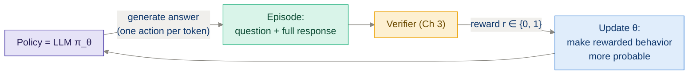
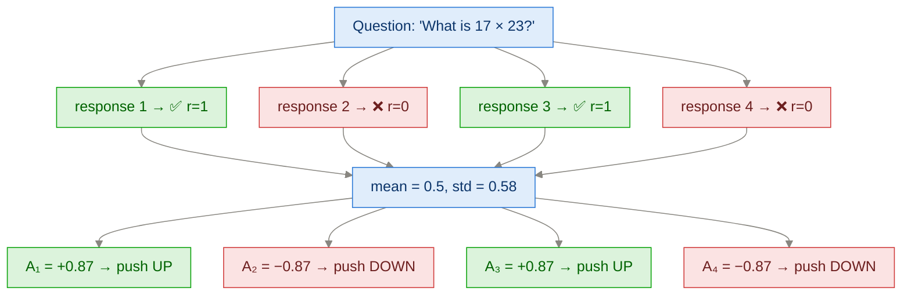
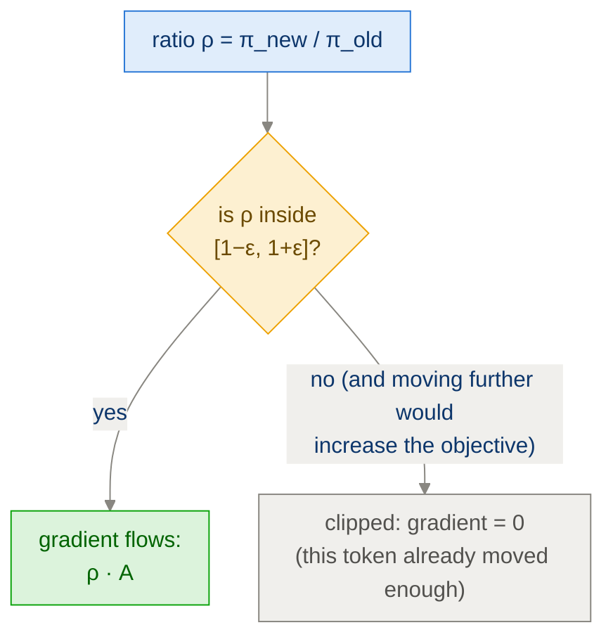
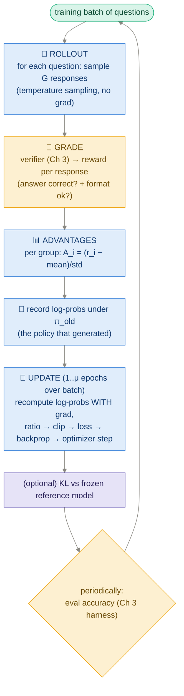

# Ch 6 · Training Reasoning Models with Reinforcement Learning (GRPO)

> **Goal of this module:** go from *zero RL knowledge* to implementing
> **GRPO** (Group Relative Policy Optimization) — the algorithm behind
> DeepSeek-R1 — driven purely by the Ch 3 verifier. This is the hardest and
> most important module; take it in order, every section builds on the last.

**Prerequisites:** [Ch 2](ch02_generating_text.md) (generation), [Ch 3](ch03_evaluating_reasoning.md) (verifier), [Ch 4](ch04_inference_time_scaling.md) (sampling).
**Feeds into:** [Ch 7](ch07_improving_grpo.md) (fixing GRPO's failure modes).

---

## 1. RL in one picture, mapped to LLMs

Classic RL vocabulary → what it means here:

| RL term | For our LLM |
|---|---|
| **Agent / policy π_θ** | The LLM itself (weights θ) |
| **State** | The prompt + tokens generated so far |
| **Action** | Emitting the next token |
| **Episode / trajectory** | One complete generated answer |
| **Reward** | Verifier output: 1 if final answer correct, else 0 (+ small format bonus) |
| **Environment** | Trivial: the "world" is just the growing text + the grader at the end |



Two features make LLM-RL *simpler* than robot-RL:

- The episode's reward comes only at the end (no per-step rewards to propagate).
- We can generate unlimited episodes on demand — just sample.

And one feature makes it *harder*: the reward is a single bit for a response of
maybe 1,000 tokens. **Credit assignment** — which tokens deserve it? — is the
central difficulty everything below addresses.

---

## 2. From "make good stuff likely" to a loss function

### 2.1 The core move: policy gradient

We can't backprop *through* the verifier (sampling & grading aren't
differentiable). The policy-gradient trick sidesteps this:

> Sample a response. If it scored well, **increase the log-probability the
> model assigns to every token of it**. If it scored badly, decrease it.

This is REINFORCE, the simplest policy gradient:

$$\nabla_\theta J = \mathbb{E}\big[\, R(y)\; \nabla_\theta \log \pi_\theta(y \mid x) \,\big], \qquad \log \pi_\theta(y|x) = \sum_{t=1}^{T} \log \pi_\theta(y_t \mid x, y_{<t})$$

In words: gradient of (reward × sum of token log-probs). Note the connection to
supervised learning: **if R=1 this is exactly the SFT/cross-entropy gradient on
that sample; if R=0 the sample is ignored.** RL ≈ "SFT on your own outputs,
weighted by how good they were."

### 2.2 The baseline problem → advantages

With rewards in {0,1}, REINFORCE only pushes *up* (never learns from wrong
answers) and has huge variance. Fix: subtract a **baseline** b and use the
**advantage** A = R − b:

- A > 0 → this response was better than expected → reinforce it
- A < 0 → worse than expected → suppress it

Classic PPO learns b with a second neural network (a *critic/value model*) as
big as the policy itself. Expensive, finicky. **GRPO's key idea replaces the
critic with statistics of a group:**

### 2.3 The GRPO baseline: the group

For each question, sample a **group of G responses** (e.g. G=8) with
temperature — Ch 4 sampling, verbatim. Grade all of them. Then, for response i:

$$A_i = \frac{r_i - \text{mean}(r_1,\dots,r_G)}{\text{std}(r_1,\dots,r_G)}$$

The group average *is* the baseline. No extra network, no learned value
function — just "were you better than your siblings?"



Every token of response i inherits the same advantage A_i (the end-of-exam
grading from the Big Picture module — crude but sufficient).

> ⚠️ **Foreshadowing Ch 7:** if *all* G responses get the same reward (all
> right or all wrong), mean = r, std = 0 → all advantages are 0 (or 0/0!) →
> **zero learning signal from that question**. Remember this.

### 2.4 Staying near the old policy: ratio + clipping (from PPO)

We generate a batch of episodes with the *current* model, then take several
gradient steps on them. After the first step the model has changed — the data
is slightly "stale" (off-policy). PPO's machinery keeps updates honest:

Per token, compute the **probability ratio** between the new and the old
(generation-time) policy:

$$\rho_t = \frac{\pi_\theta(y_t \mid \cdot)}{\pi_{\theta_{old}}(y_t \mid \cdot)}$$

and use the **clipped surrogate objective** (to be *maximized*):

$$\mathcal{L}_t = \min\Big( \rho_t A_i,\;\; \text{clip}(\rho_t,\, 1-\varepsilon,\, 1+\varepsilon)\, A_i \Big)$$

Intuition: ρ_t measures "how much more likely have I already made this token?"
Once it drifts past 1±ε (ε≈0.2), clipping **kills the gradient** — no more
credit for pushing further. It's a trust region on the cheap.



### 2.5 KL penalty: don't wander off

Additionally, GRPO (as published) subtracts β·KL(π_θ ‖ π_ref) — a penalty for
straying too far from a frozen **reference model** (the initial checkpoint).
This protects general language ability from being sacrificed to reward. (Ch 7
discusses why many recipes now set β=0.)

### 2.6 The full GRPO objective

$$J(\theta) = \mathbb{E}\left[ \frac{1}{G}\sum_{i=1}^{G} \frac{1}{|y_i|} \sum_{t} \min\big(\rho_{i,t} A_i,\; \text{clip}(\rho_{i,t}, 1\pm\varepsilon) A_i\big) \right] - \beta\, \mathbb{D}_{KL}(\pi_\theta \,\|\, \pi_{ref})$$

Read it inside-out: per-token clipped term → averaged over the response's
tokens → averaged over the group → minus KL. Every piece was motivated above.

---

## 3. The GRPO training loop, end to end



Skeleton code with the crucial shapes:

```python
for step in range(num_steps):
    batch = sample_questions(dataset, B)

    # ---- 1. ROLLOUT (no grad, sampling mode) --------------------------
    groups = []          # B groups × G responses
    for q in batch:
        responses = [generate(model, q, temperature=0.8, top_k=20)
                     for _ in range(G)]
        rewards = [verify(r, q.answer) + 0.2 * has_boxed(r) for r in responses]
        groups.append((q, responses, rewards))

    # ---- 2. ADVANTAGES (per group!) -----------------------------------
    for q, responses, rewards in groups:
        r = torch.tensor(rewards, dtype=torch.float32)
        adv = (r - r.mean()) / (r.std() + 1e-4)   # one scalar per response

    # ---- 3. Log-probs under the OLD policy (no grad) -------------------
    old_logps = token_logprobs(model, responses).detach()

    # ---- 4. UPDATE ------------------------------------------------------
    for _ in range(mu_epochs):
        new_logps = token_logprobs(model, responses)      # WITH grad
        ratio = torch.exp(new_logps - old_logps)          # per TOKEN
        unclipped = ratio * adv[:, None]                  # broadcast A over tokens
        clipped   = torch.clamp(ratio, 1-eps, 1+eps) * adv[:, None]
        loss = -torch.min(unclipped, clipped)             # maximize → negate
        loss = masked_mean_over_response_tokens(loss)     # mask prompt & padding!
        loss.backward(); optimizer.step(); optimizer.zero_grad()
```

Implementation details that cause 90% of real-world bugs:

| Detail | Why it matters |
|---|---|
| `exp(new_logp − old_logp)` not a division of probs | Numerical stability; probs underflow, log-probs don't. |
| Advantage broadcast over tokens | GRPO gives every token of a response the *same* A. |
| **Mask prompt tokens & padding** | You must only train on *generated* tokens. Training on the prompt corrupts the model fast. |
| `.detach()` on old log-probs | π_old is a snapshot; gradients must not flow into it. |
| Rollout in eval mode / update in train mode | Dropout etc. must be off during generation. |
| If μ=1 (single update per rollout) | ratio ≡ 1 on the first pass — clipping never triggers; the algorithm degenerates gracefully toward REINFORCE-with-baseline. Many minimal recipes do exactly this. |

---

## 4. What training actually looks like

Curves you should expect (and learn to read):

| Curve | Healthy | Sick |
|---|---|---|
| Mean reward / accuracy | Slow noisy climb | Sudden jump to ~1.0 (reward hacking) or flatline (no signal) |
| Response length | Often *grows* — model learns to think longer | Explodes to max_len (length hacking) or collapses to near-zero |
| KL vs reference | Grows slowly | Explodes (policy collapse) |
| Fraction of all-same-reward groups | Moderate | → 1.0 (no gradient — dataset too easy/hard for current model) |

The DeepSeek-R1-Zero "aha": with nothing but this loop and a big model,
responses spontaneously grow longer, develop self-checks ("wait, let me
verify…") and backtracking. At 0.6B scale you'll see the accuracy needle move
— the qualitative emergence is fainter, but the mechanics are identical.

---

## ⚠️ Common pitfalls

- **Zero-variance groups** (all correct / all wrong) → A=0 → wasted compute. Division by std=0 → NaN without an epsilon. Ch 7 fixes this properly (dynamic sampling).
- **Reward hacking:** weak verifier + optimizer = model finds the exploit (Ch 3 §5). Harden the verifier *before* training against it.
- **Forgetting the format reward:** with a strict answer-extractor, an early model that never emits `\boxed{}` gets r=0 forever → no signal. A small format bonus bootstraps learning.
- **Training on prompt tokens** (missing mask) — corrupts the model in a few steps.
- **Too-high learning rate:** RL fine-tuning uses tiny LRs (~1e-6 range). SFT-scale LRs (1e-4) destroy the policy.
- **Judging progress by reward on training questions only** — always run the held-out Ch 3 eval; reward can rise while general ability degrades.

---

## ✅ Self-check

<details><summary>1. Why can't we just backprop "answer correctness" through the model?</summary>

Sampling discrete tokens is non-differentiable, and the verifier is an
arbitrary program, not a differentiable function. Policy gradients convert the
problem into "differentiate the log-probability of what we sampled, scaled by
its reward" — which needs only the model's own gradients.
</details>

<details><summary>2. What does GRPO replace PPO's value network with, and what's the trade?</summary>

The within-group reward statistics (mean/std over G sampled responses per
question) serve as the baseline. Trade: no second model to train/store (huge
memory savings), but you must sample G responses per question (more rollout
compute) and the baseline is only as good as the group is informative.
</details>

<details><summary>3. A group of 8 responses gets rewards [1,1,1,1,1,1,1,1]. What gradient does this question contribute?</summary>

None. mean=1, every rᵢ − mean = 0 (and std=0 needs an epsilon to avoid NaN).
All advantages are zero — the question is too easy for the current model and
contributes only wasted rollout compute. (Ch 7's dynamic sampling filters
these out.)
</details>

<details><summary>4. What role does clipping play — in one sentence?</summary>

It zeroes the gradient for tokens whose probability has already moved more
than a factor of 1±ε from the generating policy, preventing any single batch
from dragging the policy too far (a cheap trust region).
</details>

<details><summary>5. Why is there a KL term against a frozen reference model?</summary>

The reward only measures math-answer correctness; unconstrained optimization
would happily sacrifice grammar, coherence, and general knowledge for reward.
KL-to-reference anchors the model to its initial linguistic competence. (Ch 7:
some modern recipes drop it and control drift by other means.)
</details>

---

## 🔗 Where this connects

- **Next:** [Ch 7 · Improving GRPO](ch07_improving_grpo.md) — the failure modes you just previewed, and their fixes.
- **The reward function:** [Ch 3 · Evaluation](ch03_evaluating_reasoning.md).
- **The rollout machinery:** [Ch 4 · Sampling](ch04_inference_time_scaling.md), sped up by [App E](appendix_kv_cache_batching.md).
- **The cheaper alternative:** [Ch 8 · Distillation](ch08_distillation.md).
