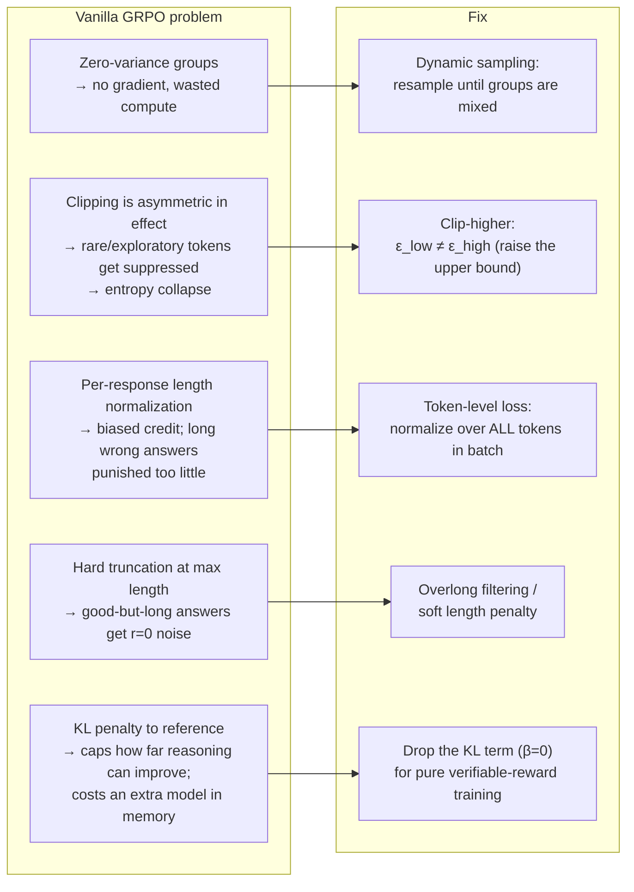
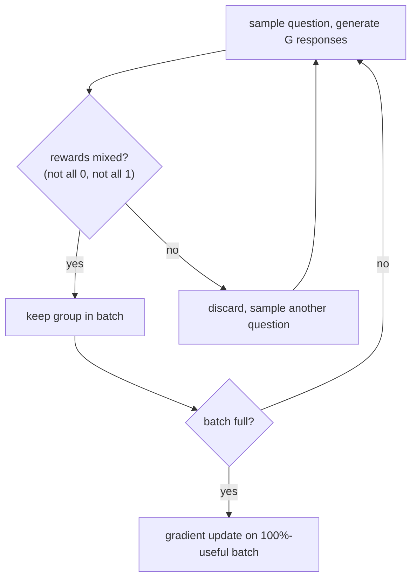
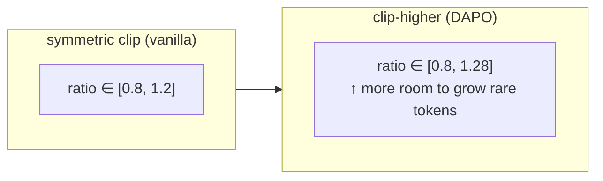
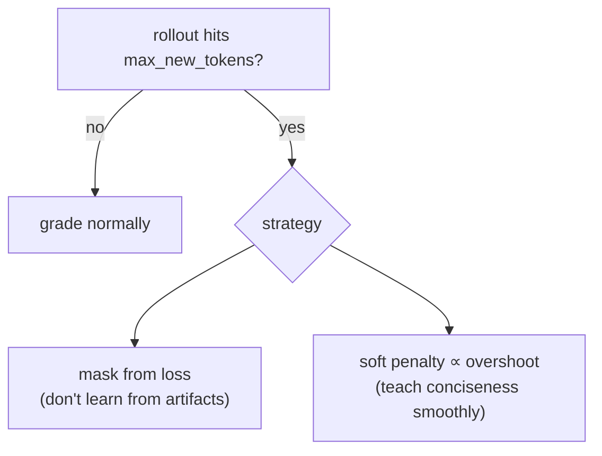
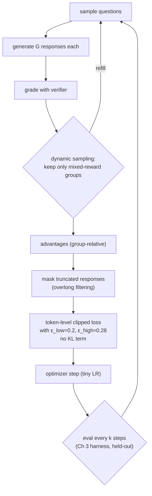

# Ch 7 · Improving GRPO for Reinforcement Learning

> **Goal of this module:** understand *why* vanilla GRPO stalls, biases, or
> collapses in practice — and the modern fixes (popularized by DAPO,
> Dr. GRPO, and the post-R1 wave of papers), each mapped to the exact term of
> the loss it repairs.

**Prerequisites:** [Ch 6](ch06_grpo_reinforcement_learning.md) — you must know the GRPO objective cold. Skim it again; this whole module is a critique of that formula.

---

## 1. The map: five problems, five fixes



Each section below: symptom → mechanism → fix → one-liner to remember.

---

## 2. Fix 1 — Dynamic sampling (the zero-gradient problem)

**Symptom.** Training slows over time even though loss code is unchanged;
more and more batches do nothing.

**Mechanism.** (Ch 6 self-check #3.) A group with identical rewards — all
correct or all wrong — has mean = r, std = 0 ⇒ every advantage is 0 ⇒ zero
gradient. As the model improves, *easy questions saturate* (all-correct groups
multiply), so the effective batch size silently shrinks.

**Fix.** Filter and refill: throw away zero-variance groups and keep sampling
new questions until the batch is full of *informative* (mixed-reward) groups.



Cost: extra rollouts. Gain: every gradient step is on-signal — empirically well
worth it (this is DAPO's headline trick). A cheaper cousin: curriculum — keep
the question pool at a difficulty where the model succeeds ~20–80% of the time.

> **Remember it as:** *no variance, no learning — so buy variance with extra sampling.*

---

## 3. Fix 2 — Clip-higher (the entropy-collapse problem)

**Symptom.** Response diversity shrinks; the model converges on one phrasing
per problem; exploration dies; pass@N gap over maj@1 closes from above.

**Mechanism.** Look at the clip range [1−ε, 1+ε] with ε=0.2. For a token with
positive advantage the *ratio* is capped at 1.2 — but that cap binds much more
tightly on **low-probability tokens**. Raising p=0.01 → 0.012 (ratio 1.2) is
nothing, while p=0.9 → 0.99 (ratio 1.1) is barely clipped at all relative to
its room to grow. Net effect: **already-likely tokens keep getting reinforced,
rare exploratory tokens can't rise fast** → the distribution sharpens →
entropy collapses.

**Fix.** Decouple the bounds: clip at [1−ε_low, 1+ε_high] with ε_high > ε_low
(e.g. 0.2 / 0.28). More upward headroom for underdog tokens, same protection
against crushing probabilities to zero.



> **Remember it as:** *let the underdogs climb — loosen only the upper bound.*

---

## 4. Fix 3 — Token-level loss (the length-bias problem)

**Symptom.** Long incorrect responses stop getting shorter; verbose rambling
persists; sample-level and token-level metrics disagree.

**Mechanism.** Vanilla GRPO averages the loss *within* each response
(`1/|y_i| Σ_t`), then across responses. So each **response** counts equally
regardless of length — meaning each **token** in a 2,000-token response
carries 1/20 the gradient weight of a token in a 100-token response. Two bad
consequences:

- A long *wrong* answer is punished per-token very weakly → verbosity survives.
- A long *right* answer's useful reasoning patterns are reinforced weakly too.

**Fix.** Normalize over **all tokens in the batch** instead:

```python
# vanilla (sample-level):    mean_over_responses( mean_over_tokens(loss_i) )
# fixed   (token-level):     sum_over_all_tokens(loss) / total_tokens_in_batch
```

Now every token carries the same weight; long responses get proportionate
credit/blame. (Dr. GRPO makes a related point about the 1/std normalization
introducing difficulty bias — easy near-saturated questions get their
advantages inflated by tiny std; some recipes drop the std division too.)

> **Remember it as:** *grade by the token, not by the essay.*

---

## 5. Fix 4 — Overlong filtering (the truncation-noise problem)

**Symptom.** Reward curve noisy; model oscillates about response length;
genuinely good long solutions seem punished.

**Mechanism.** Rollouts have a hard `max_new_tokens`. A response that is *on
its way* to a correct answer but gets truncated has no `\boxed{}` → r = 0.
That's not a signal about quality — it's an artifact of the budget — but
vanilla GRPO trains on it as if the reasoning were bad.

**Fix(es).**
1. **Overlong filtering:** mask truncated responses out of the loss entirely (no reward, no gradient).
2. **Soft overlong punishment:** a graduated penalty ramping in near the cap, so the model gets a *gentle* "wrap it up" pressure instead of a random 0.



> **Remember it as:** *don't grade the essay the proctor tore in half.*

---

## 6. Fix 5 — Dropping the KL term

**Symptom-turned-question:** what is β·KL(π‖π_ref) still buying us?

In RLHF the KL anchor is essential: the reward is a *learned model* that's easy
to hack, so staying near the reference is safety. But with **verifiable
rewards** the signal can't be flattered into misgrading — and long-CoT training
*needs* the policy to move far from the base distribution (that's the point!).
The KL term (a) limits that movement and (b) costs a full extra forward pass +
a frozen model in memory.

**Fix.** Set β = 0. Control drift instead with clipping, small LRs, and eval
checkpoints. This is the DAPO/R1-Zero-style choice and typical for
pure-math/code RL. Keep KL if your reward is learned/soft or if you observe
language degradation.

| Keep KL when… | Drop KL when… |
|---|---|
| Reward is a learned preference model | Reward is a verifier (math/code) |
| Preserving general chat behavior is critical | Task-specialization is the goal |
| Short-horizon alignment tuning | Long-CoT reasoning needs big distribution shifts |

---

## 7. The upgraded loop (all fixes assembled)



Hyperparameters that matter most, in rough order: learning rate (≈1e-6 scale)
> group size G (8–16) > clip bounds > sampling temperature (≈0.8–1.0) >
> batch composition (difficulty mix).

---

## ⚠️ Common pitfalls

- **Stacking all fixes at once on a broken run.** Change one variable at a time; each fix targets a *specific* diagnosed symptom. Log entropy, length, zero-variance-group fraction — the diagnostics *are* the chapter.
- **Dynamic sampling without a rollout budget cap** → infinite resampling when the model is uniformly bad (early) or uniformly good (late) on the pool.
- **Dropping KL *and* raising LR simultaneously** → nothing left to stop policy collapse.
- **Fixing length bias but keeping short `max_new_tokens`** → you've made truncation noise *stronger* per token. Fixes 3 and 4 travel together.
- **Interpreting longer responses as better reasoning.** Length often grows under RL, but length is not the objective — held-out accuracy is.

---

## ✅ Self-check

<details><summary>1. Why do zero-variance groups become MORE common as training succeeds?</summary>

The model improves, so questions that used to yield mixed groups become
reliably solved (all-correct groups). The static dataset's effective
difficulty falls, and more of each batch contributes zero gradient — success
starves the learning signal. Dynamic sampling or a difficulty curriculum
restores it.
</details>

<details><summary>2. Explain in one sentence each: what clip-higher, token-level loss, and overlong filtering fix.</summary>

Clip-higher gives low-probability (exploratory) tokens more upward room,
preventing entropy collapse. Token-level loss weights every token in the batch
equally so long responses receive proportionate credit/blame. Overlong
filtering stops the model from learning from rewards corrupted by hard
truncation.
</details>

<details><summary>3. Why is removing the KL penalty defensible with verifiable rewards but reckless in RLHF?</summary>

An RLHF reward model can be hacked with adversarial text, so KL-to-reference
is the guardrail. A math verifier can't be flattered — the reward is exact —
and long-CoT reasoning requires large distribution shifts that the KL term
would tax; other mechanisms (clipping, small LR) manage stability.
</details>

<details><summary>4. Your run's response length hits max_new_tokens and stays pinned there. Which fixes are implicated and in what combination?</summary>

Length hacking / truncation feedback loop: apply overlong filtering or soft
penalties (Fix 4) so truncated junk isn't randomly graded, and token-level
loss (Fix 3) so verbose wrong answers actually feel per-token pressure to
shrink. Also check the reward isn't accidentally rewarding length.
</details>

---

## 🔗 Where this connects

- **Previous:** [Ch 6 · GRPO](ch06_grpo_reinforcement_learning.md) — the formula being repaired.
- **Next:** [Ch 8 · Distillation](ch08_distillation.md) — sidestep RL entirely when a teacher exists.
- **Index:** [README](../README.md)
