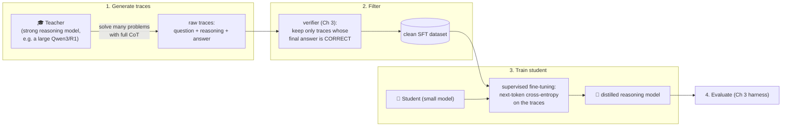
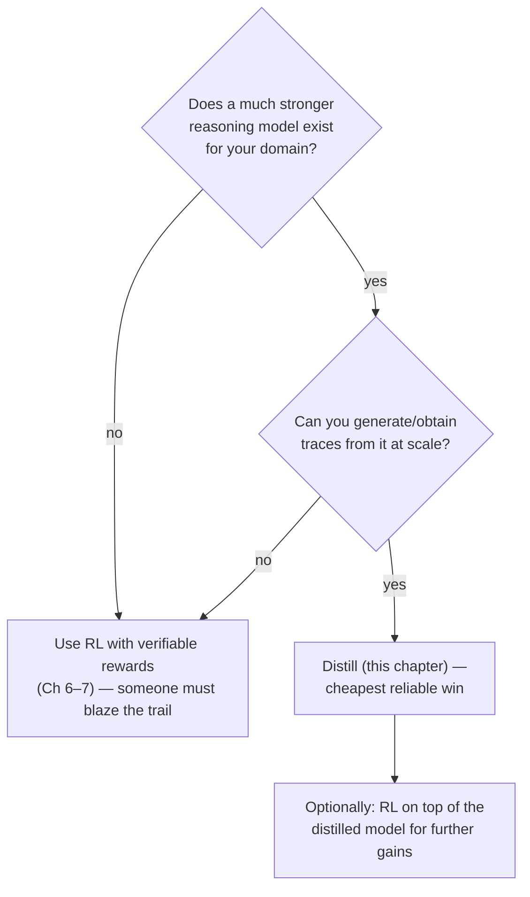
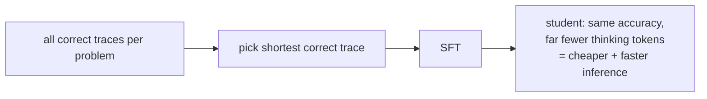

# Ch 8 · Distilling Reasoning Models for Efficient Reasoning

> **Goal of this module:** transfer reasoning ability from a strong **teacher**
> into a small **student** with plain supervised fine-tuning on reasoning
> traces — and understand when this beats RL, when it doesn't, and how it also
> makes reasoning *cheaper* (shorter), not just better.

**Prerequisites:** [Ch 2](ch02_generating_text.md) (generation), [Ch 3](ch03_evaluating_reasoning.md) (verification), [Ch 6](ch06_grpo_reinforcement_learning.md) (for the comparison).

---

## 1. The idea in one diagram



That's the whole method. Its power is its simplicity: **step 3 is ordinary
language-model training** — the same next-token prediction used in pretraining
and instruction tuning, just on very special data.

> Terminology note: classically, "knowledge distillation" (Hinton) means
> matching the teacher's full output *distribution* (soft targets / logits).
> What reasoning work — and this book — calls distillation is usually
> **hard-target sequence distillation**: train on the teacher's *sampled
> text*. Same spirit (student imitates teacher), simpler plumbing, and it
> works across tokenizer/architecture boundaries.

---

## 2. Step by step

### 2.1 Generating traces

- Prompt the teacher with the same math problems used throughout the book, in
  reasoning mode (it emits `<think>…</think>` deliberation + final answer).
- Sample multiple attempts per problem (temperature > 0) so hard problems get
  at least one correct trace — this is Ch 4's pass@N insight put to work as a
  *data collection* tool.

### 2.2 Rejection sampling — quality control via the verifier

Keep a trace only if the verifier confirms its final answer. This
verifier-filtered generation is often called **rejection sampling**:

```python
dataset = []
for q in problems:
    for _ in range(n_attempts):
        trace = teacher_generate(q, temperature=0.7)
        if verify(extract_final_answer(trace), q.answer):   # Ch 3, again!
            dataset.append(format_chat(q, trace))
            break                       # one good trace per problem is enough
```

Notice the book's leitmotif: **the verifier appears a third time** — first as
metric (Ch 3), then as RL reward (Ch 6), now as data filter (Ch 8).

### 2.3 The SFT training step

Standard causal-LM fine-tuning with one crucial detail — **loss masking**:

```python
loss = F.cross_entropy(
    logits[:, :-1].reshape(-1, vocab),   # predict token t+1 from prefix ≤ t
    targets[:, 1:].reshape(-1),          # shifted-by-one targets
    reduction="none",
).view(B, -1)
loss = (loss * response_mask[:, 1:]).sum() / response_mask[:, 1:].sum()
#              ^^^^^^^^^^^^^ train ONLY on the assistant's reasoning+answer,
#                            not on the question/prompt tokens
```


Why mask? The model shouldn't spend capacity learning to *reproduce questions*
— and unmasked prompts systematically bias the model toward parroting input.
(Same masking rule as GRPO's "never train on prompt tokens" — Ch 6.)

Typical knobs: a few epochs at LR ≈ 1e-5–5e-5 (much higher than RL's 1e-6 —
supervised targets are stable), cosine decay, small batch with gradient
accumulation.

---

## 3. Distillation vs. RL — the strategic comparison

| | 📖 Distillation | 🏋️ GRPO (Ch 6–7) |
|---|---|---|
| Signal per example | Dense: every token has a target | Sparse: one bit per whole response |
| Stability | Very stable (plain SFT) | Hyperparameter-sensitive |
| Compute | Cheap (teacher inference + short SFT) | Expensive (endless rollouts) |
| Requirement | **A stronger teacher must exist** | Only a verifier must exist |
| Ceiling | ≤ teacher (imitation) | Can exceed any existing model (discovery) |
| Failure mode | Style mimicry without competence | Reward hacking, collapse |



The headline empirical fact (DeepSeek-R1 paper, reproduced in spirit here):
**for small models, distilling from a strong teacher beats running RL on the
small model directly.** Small models often can't *discover* long-CoT strategies
via RL from scratch, but they can *imitate* them fine. The frontier lab pays
the RL bill once; everyone else distills. And the best pipeline is often
**distill → then RL**: imitation installs the reasoning skeleton, RL sharpens
it (this is how the R1 pipeline itself alternates SFT and RL stages).

---

## 4. "Efficient reasoning" — distilling for *shorter* thought

The chapter title says *efficient* reasoning, and that's a second, distinct use
of the same machinery: reasoning models **overthink** (thousands of tokens for
trivial questions). Because SFT imitates whatever's in the traces, you can
shape the *style* of reasoning by curating the traces:

- **Filter for brevity:** among correct teacher traces, keep the *shortest*
  per problem → student learns concise reasoning.
- **Mix difficulties:** short traces for easy questions, long for hard →
  student learns to *modulate* thinking length.



This closes the book's arc elegantly: Part 2 *bought* accuracy with more
tokens; this chapter shows how to *keep* accuracy while giving tokens back.

---

## ⚠️ Common pitfalls

- **Skipping verification of teacher traces.** Teachers are confidently wrong too; unfiltered traces teach confident wrongness. Always rejection-sample.
- **Forgetting the loss mask** → model that parrots questions and drifts toward completing prompts instead of answering.
- **Training on traces in a different chat template than the student will use at inference** — the silent killer; template mismatch erases gains (Ch 2 pitfall, round two).
- **Evaluating only on problems the teacher solved.** That's the training distribution; use the held-out Ch 3 benchmark.
- **Expecting the student to out-reason the teacher.** Imitation has a ceiling; if you need beyond-teacher performance, stack RL afterwards.
- **Catastrophic forgetting:** aggressive SFT on pure math traces can dent general ability; mix in some general instruction data if the student must stay a generalist.

---

## ✅ Self-check

<details><summary>1. Why does distillation work with the "weak" cross-entropy objective when RL needed all of Ch 6–7's machinery?</summary>

Because the supervision is dense and correct-by-construction: every token has
a target from a verified-correct trace, so ordinary next-token prediction has
a stable, informative gradient. RL's signal is one bit per response, produced
by the student's own exploration — hence all the variance-reduction and
stabilization machinery.
</details>

<details><summary>2. Where does the Ch 3 verifier appear in the distillation pipeline, and why is it just as critical as in RL?</summary>

As the rejection-sampling filter on teacher traces (and again in final
evaluation). Without it the dataset contains wrong reasoning taught as truth
— the SFT equivalent of reward hacking is "garbage in, garbage out."
</details>

<details><summary>3. Why do small models often benefit more from distillation than from direct RL?</summary>

RL can only reinforce behaviors the model can already sample; small models
rarely stumble onto long correct reasoning chains, so RL has little to
reinforce. Imitation hands them the behavior directly — no discovery needed.
</details>

<details><summary>4. How would you use distillation to REDUCE inference cost at constant accuracy?</summary>

Curate the SFT set for concision: for each problem keep the shortest verified-
correct teacher trace (or explicitly mix trace lengths by difficulty), so the
student learns to reach the same answers with fewer thinking tokens.
</details>

---

## 🔗 Where this connects

- **Previous:** [Ch 7 · Improving GRPO](ch07_improving_grpo.md).
- **The full pipeline picture:** [00 · Big Picture](00_big_picture.md) — you can now read every box on that map.
- **Serve your distilled model:** [App G · Chat Interface](appendix_chat_interface.md).
- **Index:** [README](../README.md)
