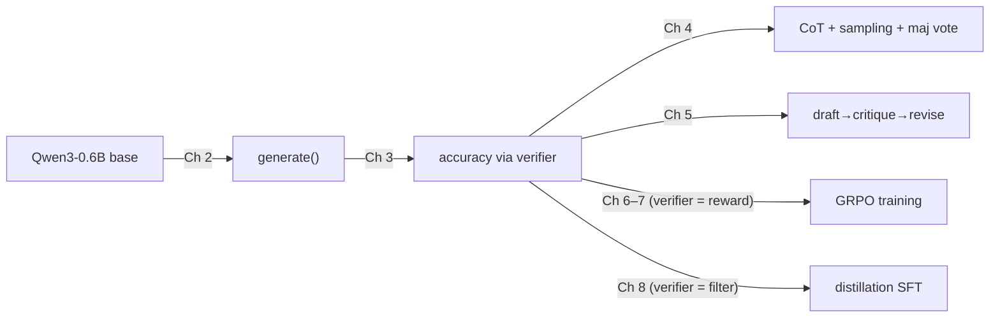
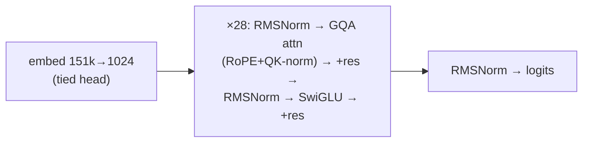

# 📄 Cheatsheet — The Whole Book on a Few Pages

> For review the night before you need it. Everything here is developed
> properly in the linked modules; nothing here is new.

---

## 1. The master map



**One sentence:** measure with a verifier, then improve — by prompting/sampling
(no training), by RL against the verifier, or by imitating a verified teacher.

**The verifier's three jobs:** metric (Ch 3) → reward (Ch 6) → data filter (Ch 8).

---

## 2. Decoding quick reference (Ch 2, 4)

```
logits → [top-k mask] → [÷ temperature] → softmax → sample (or argmax)
```

| Knob | Greedy eval | Diverse reasoning samples |
|---|---|---|
| temperature | 0 (argmax) | 0.6–1.0 |
| top-k | — | ~20–50 |
| use for | reproducible benchmarks | voting (Ch 4), GRPO rollouts (Ch 6), trace generation (Ch 8) |

Generation loop invariants: `model.eval()` · `no_grad` · stop on EOS ·
decode only `out[prompt_len:]` · chat template exactly right.

**Self-consistency:** sample N, extract answers (Ch 3 normalizer!), majority
vote. Gains flatten ~N=8–16. `pass@N ≥ maj@N ≥ maj@1`.

---

## 3. The GRPO formula, annotated (Ch 6)

$$J(\theta)=\mathbb{E}\Big[\tfrac{1}{G}\sum_{i=1}^{G}\underbrace{\tfrac{1}{|y_i|}\sum_t}_{\substack{\text{per-token avg}\\\text{(Ch 7: → batch-token avg)}}}\min\big(\underbrace{\rho_{i,t}}_{\pi_\theta/\pi_{old}}A_i,\ \text{clip}(\rho_{i,t},1\!-\!\varepsilon,1\!+\!\varepsilon)A_i\big)\Big]-\underbrace{\beta\,\mathbb{D}_{KL}(\pi_\theta\|\pi_{ref})}_{\text{Ch 7: often }\beta=0}$$

$$A_i=\frac{r_i-\text{mean}(r_{1..G})}{\text{std}(r_{1..G})}\qquad r_i=\mathbb{1}[\text{answer correct}]\ (+\ \text{format bonus})$$

Loop: **sample G per question → grade → group-normalize → clipped update →
repeat.** Sanity anchors:

- All-same rewards ⇒ A=0 ⇒ no learning (fix: dynamic sampling).
- ratio = exp(new_logp − old_logp), computed per *token*; A broadcast per *response*.
- Mask prompt & padding tokens. Always.
- LR ~1e-6 (RL) vs ~1e-5–5e-5 (SFT). Three orders of magnitude of respect.
- μ=1 update per rollout ⇒ ratio≡1 ⇒ effectively REINFORCE-with-baseline.

### GRPO vs PPO in one line
PPO: advantage from a *learned critic network*. GRPO: advantage from
*group reward statistics* — one less model, more rollouts.

---

## 4. The five GRPO fixes (Ch 7)

| # | Problem | Fix | Mnemonic |
|---|---|---|---|
| 1 | std=0 groups → no gradient | **Dynamic sampling** (resample until mixed) | no variance, no learning |
| 2 | entropy collapse | **Clip-higher** (ε_high ≈ 0.28 > ε_low = 0.2) | let underdogs climb |
| 3 | length bias | **Token-level loss** (normalize over batch tokens) | grade by the token, not the essay |
| 4 | truncation noise | **Overlong filter / soft penalty** | don't grade the torn essay |
| 5 | KL tax on reasoning shift | **β = 0** with hard verifiers | verifiers can't be flattered |

Health dashboard: reward ↑ slowly · length growing but < max · entropy > 0 ·
zero-variance-group fraction moderate · held-out accuracy tracks reward.

---

## 5. Distillation recipe (Ch 8)

```
teacher --(sample w/ temperature)--> traces --(verifier filter)--> SFT set
student + cross-entropy (loss-masked to response tokens) --> distilled model
```

- Dense signal, stable training, ceiling = teacher.
- Small models: distill first, RL after (R1 playbook).
- Efficiency variant: keep *shortest* correct trace per problem → concise reasoner.

**RL vs distillation decision:** stronger teacher exists & traces obtainable →
distill; else RL (needs only a verifier). Both need the Ch 3 harness.

---

## 6. Verifier essentials (Ch 3)

- Prompt for `\boxed{}` · extract the **last** box · **brace-matching**, not lazy regex.
- Grade with graded leniency: normalize → string eq → numeric eq → symbolic eq.
- No box ⇒ wrong (format matters; becomes the format reward in RL).
- n=500 ⇒ ±2–4% noise. Identical harness or no comparison.
- Weak verifier + RL = reward hacking. Harden before training against it.

---

## 7. Architecture at a glance (App C)



| Component | One-liner |
|---|---|
| RMSNorm | rescale by RMS, learned gain, no mean-centering |
| RoPE | rotate Q,K by position → attention sees *relative* offsets (never rotate V) |
| GQA 16Q/8KV | halves KV cache, near-free quality |
| QK-norm | normalize Q,K pre-RoPE → bounded attention logits |
| SwiGLU | `down(silu(gate x) ⊙ up x)`, 1024→3072→1024 |
| Attention/FFN division of labor | attention moves info *between* tokens; FFN computes *within* a token |

## 8. Systems numbers worth memorizing (App E)

- KV cache bytes = 2 · layers · kv_heads · head_dim · seq_len · dtype_bytes
  (0.6B @ 8k bf16 ≈ **0.9 GB per sequence** — why GQA exists).
- Prefill = compute-bound = time-to-first-token; decode = bandwidth-bound = tokens/sec.
- Batching amortizes the weight-read: B sequences ≈ B× decode throughput until compute saturates.

---

## 9. Universal pitfalls (the ones that bite in every chapter)

1. **Chat template wrong** → everything silently degrades (Ch 2, 8, G).
2. **Training/evaluating on prompt tokens** → mask or perish (Ch 6, 8).
3. **Comparing numbers across different harnesses/budgets** (Ch 3, 4, 5).
4. **Trusting a single metric** — accuracy + length + entropy + held-out, always (Ch 6, 7, F).
5. **Temperature 0 where diversity is the point** (Ch 4 voting, Ch 6 rollouts, Ch 8 trace gen).

---

## 10. Sixty-second oral-exam answers

- **Why do reasoning tokens help?** They become conditioning context — one hard prediction decomposed into many easy ones.
- **Why GRPO over PPO?** Group statistics replace the critic: less memory, simpler, at the cost of G rollouts per question.
- **Why can RL surpass distillation?** RL reinforces *discovered* behavior (unbounded); distillation imitates a teacher (bounded above by it).
- **Why do small models prefer distillation?** They rarely sample long correct chains for RL to reinforce; imitation hands them the behavior.
- **Why is math the perfect training ground?** Free, objective, ungameable-ish reward via answer checking — the whole RLVR premise.
- **Why did response length grow during RL?** Longer reasoning earns more reward via correctness; length is a side effect, monitor it (Ch 7 fixes its pathologies).
